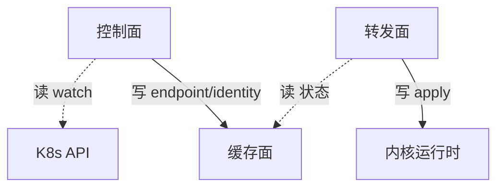
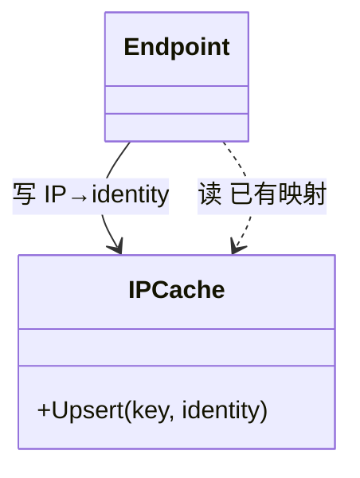

# 做事思路（方法论）

> 本文是 cilium10level 的「怎么做事」约定。逐层梳理、打磨、验收都按本文执行。
> 目标：把 Cilium 按十个面拆开，逐面确认完备性，重点核对 `(VNI, IP)` 状态表达是否落地。

---

## 1. 分层原则：业务内聚，而不是目录内聚

Cilium 的 `pkg/` 目录是工程组织的产物，不是业务边界。分层不能按目录机械切。

- **层的最小单位 = 一块内聚的业务状态 + 围绕它读写的一组对象。**
- 三个判定规则：
  1. **谁写这块状态，谁就是这块状态的归属层**（写者拥有状态）。
  2. **谁只读这块状态，谁就是它的下游**（读者依赖状态）。
  3. 两个对象共同维护同一块状态 → 同层；只互相调用但不共享状态 → 可能跨层。

> 例：`pkg/endpoint` 里的 `Endpoint` 是控制面对象（驱动生命周期、再生），
> `pkg/endpointmanager` 里的 `EndpointManager` 是缓存面对象（共享注册表/索引）。
> 控制面写，缓存面持有，转发面与切面读——这就是一条完整的读者/写者链。

**推论**：层 = 内聚的状态域；层间关系 = 读者/写者关系。所谓「承上启下」，
本质就是「读谁的状态 / 写谁的状态」。

---

## 2. 十层权威清单

| # | 面 | 一句话职责 | 主要状态域 | (VNI,IP) 状态 |
| --- | --- | --- | --- | --- |
| 1 | 控制面 | 把外部事实（K8s/CNI/kvstore）翻译成期望状态 | endpoint 生命周期、identity、IPAM、node、service 配置 | ✅ |
| 2 | 缓存面 | 内存中的共享真相（desired 与 applied 之间的缓冲） | ipcache、endpoint 索引、policy repo、identity cache、service cache | ✅ |
| 3 | 转发面 | 把期望状态落到内核 BPF/路由/iptables | BPF maps、conntrack、路由、tc/XDP | ✅（cilium_lxc 非权威） |
| 4 | 切面（可观察性） | 观察转发结果与缓存状态，输出 flow/metrics/log | monitor events、hubble flows、metrics | ✅ |
| 5 | 策略面 | 把 policy 语义编译成 identity/端口规则 | policy rules、selector、mapstate、L7 代理规则 | 经 identity 天然 ✅；CIDR/FQDN/L7 是边界 |
| 6 | 连接跟踪 / NAT 面 | 五元组状态与 NAT 映射 | ctmap、nat map | ❌（已文档化 + 运行时检测） |
| 7 | 服务 / 负载均衡面 | service→backend 解析与负载均衡 | service、frontend/backend、maglev、socket-lb | ❌（按裸 IP，启动即拒绝） |
| 8 | 加密 / egress gateway / masquerade 面 | 报文加密、出口网关、源地址伪装 | wireguard、ipsec、egress map、ipmasq | ❌（按裸 IP，启动即拒绝） |
| 9 | 生命周期面 | 升级/重启/修复的状态迁移 | restore、regeneration、dynamiclifecycle、GC | 流程性，已文档化 |
| 10 | 装配面 | hive 依赖图（组件视图的代码化） | cell 图、module 边界、P0 门禁 | 已修 + 纳入门禁 |

---

## 3. 单面分析模板（七步）

每一面都按同一模板产出，保证可比、可验收：

1. **定位**：列出归属本面的目录/文件/hive cell（可追溯到源码）。
2. **对象模型**：本面有哪些对象（struct/interface），各自职责；用 `classDiagram` 表达。
3. **状态所有权**：本面**写**哪些状态（写者即归属）。
4. **读者/写者矩阵**：本面读谁的什么、写谁的什么（承上启下）。
5. **图**：
   - 概览图：`flowchart`，节点=层，边=状态流（写）/事件流（读）。
   - 详细图：`classDiagram`，节点=对象，边=读/写。
6. **(VNI, IP) 完备性判定**：给结论 + 源码证据 + 边界/风险。
7. **边界与风险**：跨层对象、遗留耦合、尚不覆盖的场景。

---

## 4. 读者/写者关系 = 上下层上下文

### 4.1 定义

- **写者（writer）**：创建/更新/删除某块状态的对象。写者所在层 = 该状态的归属层。
- **读者（reader）**：只读该状态、依据它做决策的对象。读者所在层 = 归属层的下游。

### 4.2 两条主干流

```
意图流（写，从上往下）：
控制面 ──写──▶ 缓存面 ──读/写──▶ 转发面 ──写──▶ 内核运行时状态

观察流（读，从下往上/旁路）：
转发面 ──事件──▶ 切面
缓存面 ──快照──▶ 切面
```

- 缓存面是**共享真相**：任何面都能读，但只有归属面能写。
- 切面原则上**只读**（它只写自己的 exporter/metrics，不写业务状态）。

### 4.3 「承上启下」的标准写法

> **承上**：本面读 `X` 的 `S_x` 状态，用于 `P` 决策。
> **启下**：本面把 `S_y` 状态写给 `Y`，供其执行/观察。

---

## 5. mermaid 图式约定（读=虚箭头，写=实箭头）

所有实体间交互图都必须区分**读者**和**写者**：

- **写（writer → 被写对象）**：实线箭头。方向从「写者」指向「状态被写/被修改的对象」。
- **读（reader → 数据源）**：虚线箭头。方向从「读者」指向「被读取的数据源」。
- 每条边都要带标签，格式 `写 xxx` / `读 xxx`，一眼看出读写关系。

### 5.1 两类图各自的语法

| 图 | 用途 | 图式 | 实线（写） | 虚线（读） |
| --- | --- | --- | --- | --- |
| 层间交互图 | 概要 | `flowchart TD` | `A -->|写 xxx| B` | `A -.->|读 xxx| B` |
| 层内对象图 | 详细 | `classDiagram` | `A --> B : 写 xxx` | `A ..> B : 读 xxx` |
| 层×组件矩阵 | 视角对照 | Markdown 表 | 层=行，组件=列，单元格=该组件在该层的对象 |

### 5.2 flowchart 示例



### 5.3 classDiagram 示例



> 补充约定：
> - 同一条边如果既有读又有写，拆成两条（一虚一实），不要用一条边混标。
> - 组合/归属等**非数据**关系（如 Daemon 持有 Watcher）用 `*--` / `o--`，不占用读写箭头。
> - 装配面（hive 依赖注入）不是业务读写，用虚线并标注「装配」。

---

## 6. 组件 vs 层（层不放进组件里）

这是两个**正交**视角：

- **层（plane）**：逻辑视图，按业务内聚切分（本文的主线）。
- **组件（component）**：装配/部署视图，按进程/hive cell 切分（agent、operator、clustermesh-apiserver、hubble-relay）。

事实：

- 一个组件跨多个层：`daemon agent` 同时包含十个面的对象。
- 一个层跨多个组件：控制面横跨 `daemon`、`operator`、`clustermesh-apiserver`。

**做法**：先分层，再把每个组件拆解成「它在每个层里的对象」；不反向把层塞进组件。
**映射产物**：层 × 组件矩阵。装配面（hive 依赖图）就是这张矩阵的代码化，
它本身作为第十面单独审计（P0 门禁）。

---

## 7. 验收门禁（每面做完必须满足）

- [ ] 文件清单可追溯到源码路径，不写空话。
- [ ] 对象模型有 `classDiagram`，职责一句话能说清。
- [ ] 读者/写者矩阵无「悬空依赖」（读了没人写的状态 / 写了没人读的状态）。
- [ ] (VNI, IP) 状态有明确结论：✅ 给证据文件；❌ 给「文档化 + 运行时检测」方案。
- [ ] hive cell 全部归属到某个面，装配面做交叉核对。

---

## 8. 打磨（polish）清单

1. 术语统一：面/层/组件/对象/状态域 五个词不混用。
2. 每个 ❌ 面都要有「为什么不能表达 (VNI,IP) + 如何检测」的一段话。
3. 层间图与层内图互相引用，读者能按图索骥到源码。
4. 每面结尾给「承上启下」一句话总结，便于后续串成完整叙事。
