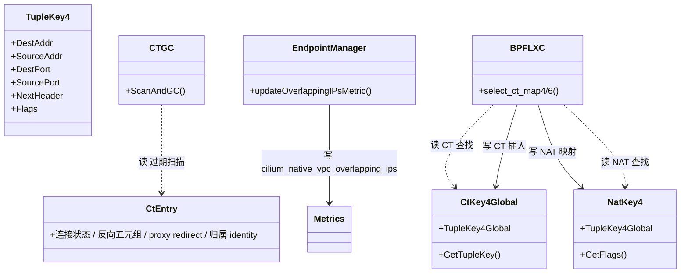
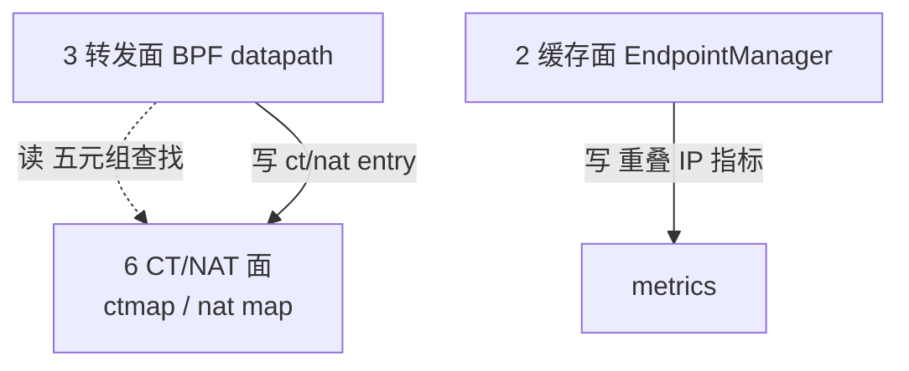

# 第 6 面：连接跟踪 / NAT 面（Conntrack / NAT Plane）

> 一句话职责：**维护五元组连接状态与 NAT 映射，供有状态转发与反向包归属。**
> 承上启下：承上**读**转发面（BPF datapath）的报文五元组；启下**写** ctmap/nat map，供同一 datapath 反向查找。

## 1. 定位（文件）

| 范围 | 目录/文件 | 说明 |
| --- | --- | --- |
| CT map | `pkg/maps/ctmap/`（ctmap.go/types.go/gc/） | 用户态 CT map 访问与 GC |
| NAT map | `pkg/maps/nat/`（nat.go/types.go/stats/） | 用户态 NAT map 访问 |
| tuple key | `pkg/tuple/ipv4.go`、`ipv6.go` | 五元组 key 定义 |
| datapath CT 逻辑 | `bpf/lib/conntrack.h`、`conntrack_map.h` | BPF 侧 CT 查找/插入 |
| datapath NAT 逻辑 | `bpf/lib/nat.h`、`nat_46x64.h` | BPF 侧 NAT |
| CT map 选择 | `bpf/bpf_lxc.c` | `select_ct_map4/6()`（per-VNI 修复的 hook） |
| 运行时检测 | `pkg/endpointmanager/manager.go`、`pkg/metrics/metrics.go` | 重叠 IP 指标 + 日志 |

## 2. 对象模型

> 图例：实线=写；虚线=读。**CT/NAT key 是裸五元组，没有任何 VNI 字段。**

## 3. 状态所有权

| 状态 | 持有者 | key | VNI？ |
| --- | --- | --- | --- |
| 连接状态 | `cilium_ct4/6_global` | 五元组（addr/port/proto/flags） | ❌ |
| NAT 映射 | `cilium_nat` | 五元组 | ❌ |
| 分片状态 | `cilium_ipv4_frag` | 五元组 + **vni**（仅 bpf_lxc） | 部分（转发面已做） |

## 4. 读者/写者矩阵（承上启下）

| 方向 | 读/写 | 对象 | 状态 | 用途 |
| --- | --- | --- | --- | --- |
| 承上（读） | 读 | 转发面 BPF 报文 | 五元组 | 建 CT/NAT entry |
| 启下（写） | 写 | ctmap | 连接状态/反向五元组 | 反向包归属/策略跳过 |
| 启下（写） | 写 | nat map | NAT 映射 | SNAT/DNAT |

## 5. 层间概览（聚焦 CT/NAT 面）

## 6. (VNI, IP) 完备性判定：❌ 今天无法表达 (VNI, IP)

结论：CT key 是裸五元组（`struct ipv4_ct_tuple`：addr/port/proto/flags），**没有 VNI 字段**；
上游只扩展了 ClusterMesh 的 *cluster* 作用域（`cilium_per_cluster_ct_*`，静态 map-of-maps），
无法泛化到数百个逻辑交换机/VNI。

| 项 | 证据 | 说明 |
| --- | --- | --- |
| key 无 VNI | `pkg/tuple/ipv4.go`（`tupleKey`）、`pkg/maps/ctmap/types.go`（`CtKey4Global`） | 裸五元组 |
| NAT key 无 VNI | `pkg/maps/nat/types.go`（`NatKey4/6`） | 裸五元组 |
| 文档化失败模式 | `Documentation/network/native-vpc.rst`（Conntrack and NAT plane） | 同节点同 IP 不同 VNI + 同五元组 → 共享 CT entry |
| 运行时检测 | `pkg/endpointmanager/manager.go`（`updateOverlappingIPsMetric`）、`pkg/metrics/metrics.go` | `cilium_native_vpc_overlapping_ips` |
| 启动拒绝 | `daemon/cmd/daemon.go`（`nativeVPCDatapathCompatibility`） | BPF masquerade/KPR/socketLB 启动即拒绝，NAT 保持 inert |

### 失败模式

同节点两个不同 VPC 的 endpoint 共享同一 IP，若再与同一 peer 的 addr/port/proto + 同一临时源端口通信，
它们共享一个 CT entry。后果：

1. 第二条连接被当作 established，**绕过本 VPC 的策略**（策略只在首包评估）；
2. 回包被归属到**另一 VPC 的 peer identity**。

### 缓解（今天）

- **调度**：不要让重叠 IP 的 pod 共节点（pod 反亲和 / kube-ovn 调度策略），可彻底消除。
- **检测**：`cilium_native_vpc_overlapping_ips > 0` 告警；0 表示该节点无 CT 歧义。
- **NAT 惰性**：BPF masquerade / KPR / socketLB 启动即拒绝，kube-ovn 自做 SNAT，NAT map 不参与。

### 修复计划（follow-up）

per-VNI CT 状态。hook 已存在：`bpf/bpf_lxc.c` 的 `select_ct_map4/6()` 运行时选 map，
缺 map 已 fail-closed（`DROP_CT_NO_MAP_FOUND`）。需要：

1. `HASH_OF_MAPS` 外层 map，按 VNI 键（现有 per-cluster 是静态 `ARRAY_OF_MAPS`，不随 VNI 数量扩展）；
2. agent 侧 inner-map 生命周期（首个 endpoint 建、最后一个删）；
3. CT GC 遍历 inner maps（复用 per-cluster GC 机制）；
4. 预算切分：inner maps 均分每 VNI 的 CT 预算。

> 不推荐给 `struct ipv4_ct_tuple` 加 VNI 字段：会动 CT/NAT/DSR/service 共享的 key 布局。

## 7. 边界与风险

- **边界**：分片 map（`ipv4_frag`）已被转发面 VNI 化（`bpf/lib/ipv4.h`），
  这是 CT/NAT 面唯一「部分 VNI 化」的结构，不能算本面完成。
- **风险 1**：策略绕过（首包后不再评估）是最严重后果，重叠 IP 共节点必须视为不安全而非小概率。
- **风险 2**：`cilium_native_vpc_overlapping_ips` 是**节点级**指标，需集群级聚合告警；
  且它只测「IP 被多个本地 endpoint 使用」，无法测「同五元组」的实际碰撞。
- **风险 3**：NAT 惰性依赖启动拒绝面（第 10 面门禁），若某特性漏加拒绝判断，NAT 会重新活跃并产生裸五元组碰撞。

## 8. 承上启下一句话

> CT/NAT 面**读/写**裸五元组状态，**无法表达 (VNI, IP)**；
> 今天靠「调度隔离 + 重叠 IP 指标告警 + NAT 惰性（启动拒绝）」三层缓解，per-VNI CT 是唯一正确修复，hook 已就位。
