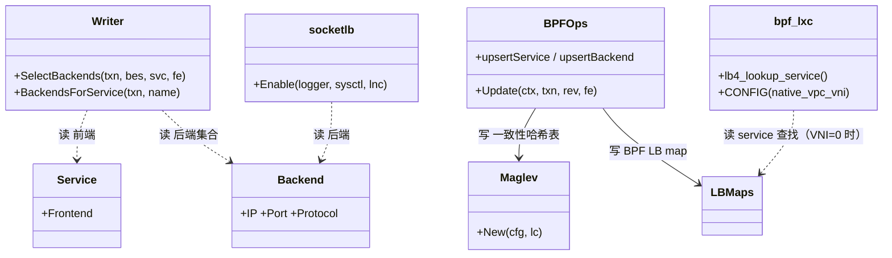
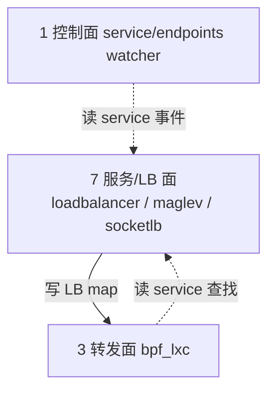

# 第 7 面：服务 / 负载均衡面（Service / Load-Balancing Plane）

> 一句话职责：**把 service 前端解析到 backend 集合，并下发 LB map / socket LB 供转发面做负载均衡。**
> 承上启下：承上**读**控制面写入的 service/endpoints 期望；启下**写** BPF LB map / socket LB 状态。

## 1. 定位（文件）

| 范围 | 目录/文件 | 说明 |
| --- | --- | --- |
| service 数据模型 | `pkg/loadbalancer/`（service.go/frontend.go/backend.go） | frontend/backend |
| 下发/对账 | `pkg/loadbalancer/`（writer/reconciler/maps/healthserver/redirectpolicy） | LB map 写入 |
| KPR | `pkg/kpr/` | kube-proxy replacement |
| maglev | `pkg/maglev/` | 一致性哈希 |
| socket LB | `pkg/socketlb/` | cgroup socket LB |
| service watcher | `pkg/k8s/watchers/`（service/endpoints） | K8s service 事件 |
| 宣告/IPAM | `pkg/l2announcer/`、`pkg/lbipamconfig/`、`pkg/bgp/` | 服务宣告 |
| datapath LB | `bpf/lib/lb.h`、`bpf/lib/nodeport.h` | BPF LB 查找 |
| 启动拒绝 | `daemon/cmd/daemon.go` | `nativeVPCDatapathCompatibility` |

## 2. 对象模型



> 图例：实线=写；虚线=读。**打磨修正**：`LBWriter` 拆成 `Writer`（选 backend）+ `BPFOps`（写 BPF map）；
> `SocketLB`→`socketlb`（包，函数 `Enable`）；`BPFLXC`→`bpf_lxc`。**backend key = (IP, port, protocol)，地址是裸 IP，无 VNI。**

## 3. 状态所有权

| 状态 | 持有者 | key | VNI？ |
| --- | --- | --- | --- |
| service 前端 | `pkg/loadbalancer` | VIP/port/proto | 前端是集群级 VIP，VPC 无关 |
| backend 集合 | `pkg/loadbalancer` | **(IP, port, protocol)** | ❌ 裸 IP |
| maglev 表 | `pkg/maglev` | backend 序号 | ❌ |
| BPF LB map | `cilium_lb*` | backend key | ❌ |
| socket LB | cgroup map | (IP, port) | ❌ |

## 4. 读者/写者矩阵（承上启下）

| 方向 | 读/写 | 对象 | 状态 | 用途 |
| --- | --- | --- | --- | --- |
| 承上（读） | 读 | 控制面 watcher | service/endpoints | 建 LB 表 |
| 启下（写） | 写 | BPF LB map | backend 映射 | 转发面 LB |
| 启下（写） | 写 | socket LB map | (IP,port) 映射 | socket 级 LB |

## 5. 层间概览（聚焦服务/LB 面）



## 6. (VNI, IP) 完备性判定：❌ 按裸 IP —— 启动即拒绝

结论：backend 按 `(IP, port, protocol)` 键，backend 地址就是裸 IP；
两个 VPC 的 pod 共享 IP 时会在 backend 里塌缩成一条，且翻译会把 A 租户流量**静默重定向**到 B 租户的同 IP pod。
native-vpc 下**启动即拒绝**，两层关闭：

| 层 | 证据 | 机制 |
| --- | --- | --- |
| 配置层拒绝 | `daemon/cmd/daemon.go` | KPR / socketLB 启动即拒绝 |
| 数据面绕过 | `Documentation/network/native-vpc.rst` + `bpf/bpf_lxc.c` | `CONFIG(native_vpc_vni)>0` 时 `bpf_lxc` 完全跳过 `lb4_lookup_service()` |

### 为什么 `kubeProxyReplacement: false` 不够

1. LB 控制面（reflectors/maps/reconciler）在 agent 里**无条件注册**，BPF service/backend map 仍被创建和填充；
2. 只有 NodePort/LoadBalancer/HostPort 前端受 KPR 门控——**ClusterIP 前端无条件反射**，每个 ClusterIP 都进 BPF map；
3. `bpf_lxc` 在 socket LB 未全开或 SCTP 开启时仍编译逐包 LB。

因此必须靠**数据面规则**：VNI endpoint 直接跳过 service 查找，把 service 解析留给 kube-ovn/kube-proxy
在其 VPC 自己的路由域内完成。

### 验证命令

```shell
cilium-dbg bpf lb list | head          # map 存在且被填充（即使 KPR=false）
cilium-dbg monitor --type trace | grep <clusterIP>  # VPC pod 到 ClusterIP 应原样离开，不被翻译
```

## 7. 边界与风险

- **边界**：service **前端**是集群级 VIP，天然 VPC 无关，Hubble 富化/health checker 只碰前端，不受影响；
  `CiliumLocalRedirectPolicy` 不被 KPR 门控，但它重定向到 backend 地址，在 VPC endpoint 上无效且不安全。
- **风险 1**：如果新增一个 LB 特性没被启动拒绝覆盖，backend 裸 IP 碰撞会重新引入「跨租户重定向」。
- **风险 2**：数据面跳过 service 查找依赖 `bpf_lxc` 的 `CONFIG(native_vpc_vni)`，host/tunnel 路径必须由 kube-ovn 拥有
  （与转发面风险 2 同一前提）。
- **风险 3**：maglev/socketLB 的 key 无 VNI 字段，任何「纯数据面绕过配置门控」的路径都是漏洞。

## 8. 承上启下一句话

> 服务/LB 面**读** service 期望、**写**裸 IP 的 backend/LB map，**无法表达 (VNI, IP)**；
> 通过「启动即拒绝 + bpf_lxc 跳过 service 查找」把 LB 完全让渡给 kube-ovn/kube-proxy。
