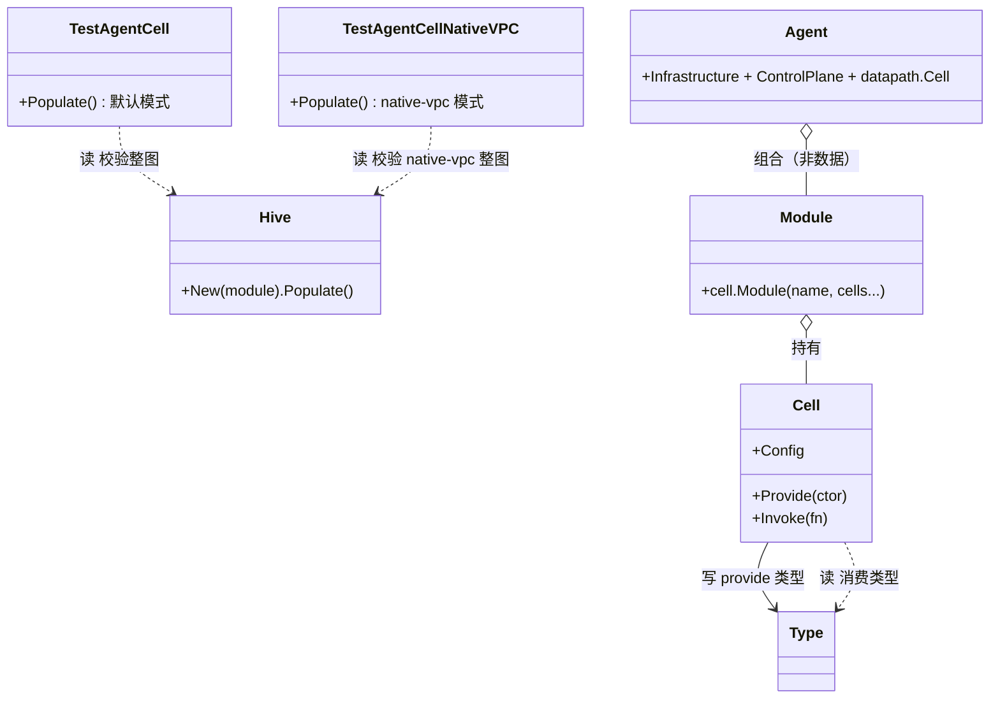
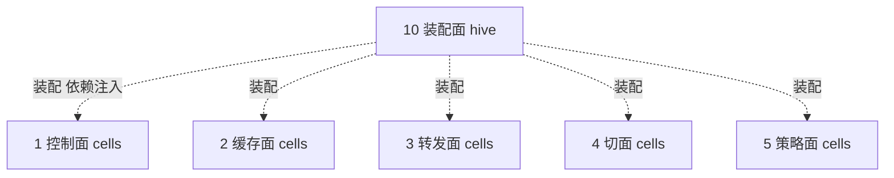

# 第 10 面：装配面（hive 依赖图 / Assembly Plane）

> 一句话职责：**代码化的组件视图——用 hive cell 把十面的对象装配成可启动的 agent/operator/clustermesh。**
> 承上启下：承上**声明**每个对象需要哪些依赖（读）；启下**提供**每个对象给依赖方（写），并校验整图可实例化。

## 1. 定位（文件）

| 范围 | 目录/文件 | 说明 |
| --- | --- | --- |
| hive 框架 | `pkg/hive/`（hive.go/cell/jobs/health） | cell 装配框架 |
| agent 装配图 | `daemon/cmd/cells.go`、`root.go` | `Agent` / `Infrastructure` / `ControlPlane` module |
| 装配自检 | `daemon/cmd/cells_test.go` | `TestAgentCell` / `TestAgentCellNativeVPC` |
| 启动拒绝门禁 | `daemon/cmd/native_vpc_validation_test.go` | 裸 IP 键特性的启动拒绝测试 |
| operator 装配 | `operator/cmd/root.go`、`lifecycle.go` | operator 侧 `ControlPlane` |
| datapath 子装配 | `pkg/datapath/cells.go` | 各子模块 cell |
| clustermesh 装配 | `clustermesh-apiserver/` | 多集群装配 |

## 2. 对象模型

> 图例：实线=写（provide）；虚线=读（consume）。**打磨修正**：`TestAgentCell`/`TestAgentCellNativeVPC` 是测试函数（`daemon/cmd/cells_test.go`），
> 不是类型，在此表为校验动作。装配面是「组件视图的代码化」，cell 之间的 provide/consume 就是层×组件矩阵的边。

## 3. 状态所有权

装配面**拥有依赖图本身**（不拥有业务状态）：

| 状态 | 持有者 | 说明 |
| --- | --- | --- |
| 类型依赖图 | `hive` | 哪个 cell provide 哪个类型、哪个 cell 消费哪个类型 |
| 启动顺序 | `cell.Lifecycle` | Start/Stop hook |
| module 边界 | `cell.Module` | `Infrastructure` / `ControlPlane` / `datapath.Cell` |

## 4. 读者/写者矩阵（承上启下）

| 方向 | 读/写 | 对象 | 状态 | 用途 |
| --- | --- | --- | --- | --- |
| 承上（声明） | 读 | cell 构造参数 | 依赖类型 | 装配对象 |
| 启下（提供） | 写 | cell 构造返回值 | 产出类型 | 供下游 cell 消费 |
| 校验 | 读 | 整图 | 缺失类型/可选接口降级/条件分支门控 | 启动自检 |

## 5. 层间概览（聚焦装配面）

## 6. (VNI, IP) 完备性判定：本轮发现 P0，已修 + 纳入验收门禁

结论：装配面本身不产生 `(VNI, IP)` 键，但它是**VNI 语义在组件维度不丢链的最终守卫**。
本轮（设计文档审计）发现一个 P0：native-vpc 模式下 agent 对象图构建失败/可选接口静默退化，已修并纳入门禁。

| 环节 | 证据 | 机制 |
| --- | --- | --- |
| 默认装配自检 | `daemon/cmd/cells_test.go` | `TestAgentCell`：`hive.New(Agent).Populate()` |
| native-vpc 装配自检 | 同上 | `TestAgentCellNativeVPC`：开 `EnableNativeVPC` 后整图仍可构建 |
| 启动拒绝门禁测试 | `daemon/cmd/native_vpc_validation_test.go` | 裸 IP 键特性在 native-vpc 下拒绝、关闭时不受影响 |
| 三个失败模式 | `Documentation/network/native-vpc.rst`（Assembly plane） | missing type / 可选接口降级 / 条件分支门控 |

### 三个失败模式（package 级测试抓不到）

1. **缺失类型**：cell 构造参数无 provider → 整个 agent 启动失败（`missing type: ...`）。
2. **可选接口静默退化**：生产类型不再实现 VNI-aware 接口 → 消费者无声退化为裸 IP 路径。
3. **条件分支门控被跳过**：门控写在条件分支里 → 某些配置下不执行。

对应修法：两种模式都跑 `Populate()`；VNI-aware 接口加编译期断言；门控无条件求值。

## 7. 边界与风险

- **边界**：装配面是「组件视图」的代码化，它与「层视图」正交；层×组件矩阵的每一格在这里变成 cell 依赖边。
- **风险 1**：新增 VNI 依赖时必须同时维护 `TestAgentCell` 与 `TestAgentCellNativeVPC`，否则缺失类型/降级回归。
- **风险 2**：`ControlPlane` module 里混入了策略面/服务面/加密面的 cell（第 1 面边界已述），
  装配边界 ≠ 业务边界，审计时以「谁写状态」为准，不能以 module 归属为准。
- **风险 3**：operator 与 agent 是两个独立 hive 图，VNI 语义靠 CEP annotation 跨进程传播，
  需在装配面交叉核对两边 provider 一致性。

## 8. 承上启下一句话

> 装配面**读**每个 cell 的依赖、**写**每个 cell 的产出，用 `Populate()` 把十面对象图钉在一起；
> `TestAgentCellNativeVPC` 是 VNI 语义在组件维度不丢链的最终门禁。
