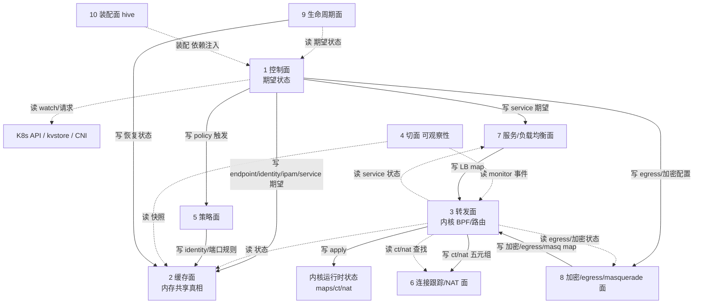

# 十面总览 + 文件梳理

> 基线：`/root/7/cilium`。文件梳理只标注**归属面**，跨层对象在归属面正文里说明。
> 每面的完整分析见 `map/01~10`。

## 1. 层间交互概要图

> 图例：实线=写（写者→被写对象）；虚线=读（读者→数据源）；`装配` 是依赖注入关系，非业务读写。

## 2. 层边界确认（内聚性 + 组件）

层 = 一块内聚的业务状态域 + 读写它的对象。**谁写状态，谁就是归属层**；组件（hive cell / 进程）只是装配容器，不决定边界。

| 面 | 内聚状态域（谁写） | 主要组件 | 边界判定 |
| --- | --- | --- | --- |
| 1 控制面 | endpoint 生命周期 / identity / IPAM / node / service 期望（`Endpoint`/`K8sWatcher`/`IPAM`/`NodeManager` 写） | daemon agent、operator、clustermesh-apiserver | 翻译外部事实，不拥有缓存/内核态 |
| 2 缓存面 | 内存共享真相（`IPCache`/`EndpointManager`/`IDManager` 持有） | daemon agent | 主写者在外（控制面），自身只维护索引+通知 |
| 3 转发面 | 内核运行时（`BPFListener`/`Loader`/BPF 写） | daemon agent（bpf 程序） | 只执行，不做业务决策 |
| 4 切面 | 导出产物（`Parser`/`EndpointResolver`/`ContextOptions` 写） | daemon agent、hubble-relay | 纯读者，写自己的 flow/metrics/log |
| 5 策略面 | 规则/selector/mapstate/L7 规则（`PolicyRepository`/`policyCache`/`DNSProxy` 写） | daemon agent、operator(policyderivative) | 经 identity 语义，不碰 IP key |
| 6 CT/NAT | 五元组连接状态（`GC`/BPF 写 ct/nat map） | daemon agent | 裸五元组，无 VNI |
| 7 服务/LB | service→backend（`Writer`/`BPFOps` 写） | daemon agent、operator(lbipam/bgp) | backend 裸 IP，无 VNI |
| 8 加密/egress/masq | 加密态/egress/ipmasq（`wireguard.Agent`/`ipsec.Agent`/`egressgateway.Manager`/`IPMasqAgent` 写） | daemon agent | 地址键，无 VNI |
| 9 生命周期 | 状态迁移（`endpointRestorer`/`LocalIdentityRestorer`/`Regenerator` 写） | daemon agent、operator | 流程性，不长期拥有业务状态 |
| 10 装配 | 依赖图本身（`hive`/`cell` 装配） | 所有进程 | 组件视图的代码化 |

## 3. 顶层 API（CRD）→ 各层核心对象（从上到下）

Cilium 的顶层接口是 **Kubernetes CRD + CNI + kvstore + daemon REST API**。按「一条对象从 CRD 进来，落到哪个层的哪个对象」梳理核心对象：

| 顶层 API 入口 | 控制面对象 | 缓存面对象 | 策略面对象 | 转发面/执行对象 | 切面对象 |
| --- | --- | --- | --- | --- | --- |
| Pod/CEP（`ovn.kubernetes.io/tunnel_key` VNI annotation） | `K8sWatcher`、`Endpoint` | `IPCache`、`EndpointManager` | — | `BPFListener`、`VniKey`、`cilium_ipcache_vni` | `EndpointResolver`、`Flow.vni_id` |
| CN/CID/CES | `K8sWatcher`、`CachingIdentityAllocator` | `IDManager` | `GlobalIdentity`（VNI label） | `policymap`（identity 键） | — |
| CNP/CCNP | `policy/k8s watcher` | `PolicyRepository`、`SelectorCache` | `policyCache`、`mapState` | `policymap` | — |
| Service/Endpoints | `K8sWatcher` | — | — | `Writer`、`BPFOps`、`cilium_lb*` | `ContextOptions`（vni 标签，仅前端） |
| CiliumEnvoyConfig / Ingress / GatewayAPI | `ciliumenvoyconfig`、`envoy` | — | `DNSProxy`/Envoy | — | `LogRecord.VNIID` |
| CiliumEgressGatewayPolicy / IPsec/WG 配置 | `egressgateway.Manager`、`wireguard.Agent`、`ipsec.Agent` | — | — | egress/ipmasq/xfrm/WG peer | — |
| CNI ADD/DEL | `Endpoint`、`IPAM` | `IPCache`、`EndpointManager` | — | `Loader`、`bpf_lxc` | — |
| kvstore（identity/ipcache/service） | `IPIdentitySynchronizer` | `IPCache`（`ip@vni:N`） | — | `BPFListener` | — |

> 这就是「地图」的主干：每个 CRD 入口都是一条路的起点，沿控制面→缓存面→策略面→转发面→切面逐层落地。

## 4. 十面文件梳理

### 1. 控制面

| 目录/文件 | 内容 |
| --- | --- |
| `daemon/cmd/cells.go` | `ControlPlane` hive module 定义（agent 侧权威边界） |
| `daemon/cmd/daemon.go`、`daemon_main.go` | Daemon 编排、启动顺序 |
| `daemon/k8s/` | agent 侧 K8s Resources/Tables cell |
| `pkg/k8s/watchers/` | 核心 watcher（Pod/Node/Service/CEP/CNP…） |
| `pkg/k8s/`（informer/resource/slim/apis/synced） | K8s 资源访问与同步 |
| `pkg/identity/identitymanager/`、`pkg/identity/key/` | identity 分配与 key（含 VNI label） |
| `pkg/ipam/`（allocator/node_manager/multipool） | 每节点 IP 分配 |
| `pkg/node/`、`pkg/nodediscovery/`、`pkg/node/sync/` | 节点状态与发现 |
| `pkg/endpoint/`（endpoint.go/restore.go/regeneration/） | endpoint 生命周期、再生 |
| `operator/cmd/root.go` | operator 侧 `ControlPlane` module |
| `operator/`（identitygc/endpointgc/ipam/lbipam/nodeipam/…） | 集群级控制器 |
| `clustermesh-apiserver/`、`pkg/clustermesh/` | 多集群控制面 |
| `pkg/controller/` | 控制循环基础设施 |

### 2. 缓存面

| 目录/文件 | 内容 |
| --- | --- |
| `pkg/ipcache/ipcache.go` | IP→identity 缓存（核心，含 `KeyWithVNI`） |
| `pkg/identity/cache/` | identity 缓存 |
| `pkg/endpointmanager/manager.go` | endpoint 共享注册表/索引（含 VNI lookup） |
| `pkg/policy/repository.go`、`selectorcache.go` | policy 仓储与 selector 缓存 |
| `pkg/fqdn/cache.go` | DNS→IP 缓存 |
| `pkg/loadbalancer/`（service/frontend/backend） | service 数据模型与缓存 |
| `pkg/node/manager/` | 其它节点缓存 |
| `pkg/clustermesh/store/`、`pkg/clustermesh/remote_cluster.go` | 远程集群缓存 |
| `pkg/k8s/statedb.go`、slim informer store | K8s 对象内存快照 |
| `pkg/datapath/tables/` | 设备/邻居/路由等内核对象的内存表 |

### 3. 转发面

| 目录/文件 | 内容 |
| --- | --- |
| `bpf/*.c`、`bpf/lib/*.h` | 实际 datapath 程序（lxc/host/overlay/xdp） |
| `pkg/datapath/`（loader/connector/iptables/tunnel/node/…） | 把状态 apply 到内核 |
| `pkg/datapath/ipcache/listener.go` | ipcache → BPF map 同步（含 VNI 路由） |
| `pkg/maps/`（ipcache/ctmap/nat/policymap/lxcmap/…） | BPF map 封装 |
| `pkg/ebpf/`、`pkg/bpf/` | BPF 基础设施 |
| `pkg/endpoint/bpf.go`、`pkg/endpoint/regeneration/` | endpoint 侧 BPF 再生 |
| `pkg/datapath/linux/`（sysctl/ipsec/route/bandwidth） | Linux 网络栈落地 |
| `pkg/mtu/`、`pkg/mac/` | 网络参数 |

### 4. 切面（可观察性）

| 目录/文件 | 内容 |
| --- | --- |
| `pkg/hubble/`（observer/server/metrics/exporter/parser） | Hubble flow 管线 |
| `pkg/monitor/`（agent/notifications/dissect/datapath_*） | monitor 事件源与解析 |
| `pkg/metrics/` | 全部 Prometheus 指标 |
| `pkg/metrics/features/` | feature 门禁指标 |
| `pkg/status/` | 状态收集 |
| `pkg/health/`、`cilium-health/` | 连通性探测 |
| `pkg/flowdebug/`、`pkg/spanstat/` | 调试/耗时统计 |
| `pkg/debug/`、`pkg/pprof/` | debug API |
| `hubble-relay/` | 集群级 Hubble 中继 |

### 5. 策略面

| 目录/文件 | 内容 |
| --- | --- |
| `pkg/policy/`（api/rules/distillery/resolve/selectorcache/mapstate/cookie/groups） | policy 语义与编译 |
| `pkg/policy/k8s/`、`pkg/policy/directory/` | policy 源接入 |
| `pkg/labels/`、`pkg/labelsfilter/` | 标签与 identity 派生 |
| `pkg/identity/` | identity 语义 |
| `pkg/fqdn/`（rules/namemanager/dnsproxy/matchpattern） | DNS/L7 policy |
| `pkg/proxy/`、`pkg/envoy/` | L7 代理规则下发 |
| `pkg/auth/` | policy 认证 |

### 6. 连接跟踪 / NAT 面

| 目录/文件 | 内容 |
| --- | --- |
| `pkg/maps/ctmap/`（含 `gc/`） | conntrack map |
| `pkg/maps/nat/`（含 `stats/`） | NAT map |
| `bpf/lib/conntrack.h`、`bpf/lib/nat.h`、`bpf/lib/nat_46x64.h` | datapath 侧 CT/NAT 逻辑 |

### 7. 服务 / 负载均衡面

| 目录/文件 | 内容 |
| --- | --- |
| `pkg/loadbalancer/`（writer/reconciler/maps/healthserver/redirectpolicy） | service 配置与下发 |
| `pkg/k8s/watchers/`（service/endpoints） | service watcher |
| `pkg/kpr/` | Kube-proxy replacement |
| `pkg/maglev/` | maglev 一致性哈希 |
| `pkg/socketlb/` | socket 级 LB |
| `pkg/l2announcer/`、`pkg/lbipamconfig/`、`pkg/bgp/` | service 宣告/IPAM |
| `bpf/lib/lb.h`、`bpf/lib/nodeport.h` | datapath LB |

### 8. 加密 / egress gateway / masquerade 面

| 目录/文件 | 内容 |
| --- | --- |
| `pkg/wireguard/`、`pkg/datapath/linux/ipsec/`、`pkg/maps/encrypt/` | 加密 |
| `pkg/egressgateway/`（manager/policy/endpoint） | egress gateway |
| `pkg/ipmasq/`、`pkg/maps/ipmasq/` | masquerade |
| `bpf/lib/ipsec.h`、`bpf/lib/egress_gateway.h`、`bpf/lib/encrypt.h` | datapath 侧逻辑 |
| `pkg/datapath/loader/encryption.go`、`wireguard.go` | loader 侧配置 |

### 9. 生命周期面

| 目录/文件 | 内容 |
| --- | --- |
| `daemon/cmd/endpoint_restore.go` | 启动恢复 |
| `pkg/endpoint/restore.go`、`pkg/ipcache/restore/` | 状态恢复 |
| `pkg/endpoint/regeneration/` | 再生生命周期 |
| `pkg/dynamiclifecycle/`、`pkg/dynamicconfig/`、`pkg/driftchecker/` | 动态启停/漂移检测 |
| `operator/cmd/lifecycle.go` | operator 领导者生命周期 |
| `pkg/hive/`（health/ondemand/fence） | 生命周期原语 |
| `pkg/controller/` | 控制循环（GC/重试） |

### 10. 装配面

| 目录/文件 | 内容 |
| --- | --- |
| `pkg/hive/`（hive.go/cell/jobs） | hive 框架 |
| `daemon/cmd/cells.go`、`root.go` | agent 装配图 |
| `operator/cmd/root.go`、`lifecycle.go` | operator 装配图 |
| `pkg/datapath/cells.go` 及各包 `cell.go` | 子模块装配 |
| `clustermesh-apiserver/` | clustermesh 装配 |

## 5. 层 × 组件 矩阵（层与组件正交）

| 面 | daemon agent | operator | clustermesh-apiserver | hubble-relay |
| --- | --- | --- | --- | --- |
| 1 控制面 | Endpoint/Identity/IPAM/Node/watchers | 集群级控制器（identitygc/endpointgc/ipam/gateway） | 多集群控制 | — |
| 2 缓存面 | ipcache/endpointmanager/policy repo | — | 远程集群缓存 | — |
| 3 转发面 | loader/maps/BPF | — | — | — |
| 4 切面 | monitor/metrics/hubble server | operator metrics | — | hubble 中继 |
| 5 策略面 | policy repo/distillery/L7 | policyderivative | — | — |
| 6 CT/NAT | ctmap/nat map | — | — | — |
| 7 服务/LB | loadbalancer/kpr/maglev | lbipam/bgp | — | — |
| 8 加密/egress/masq | wireguard/ipsec/egress/ipmasq | — | — | — |
| 9 生命周期 | restore/regeneration/dynamiclifecycle | WithLeaderLifecycle | — | — |
| 10 装配 | daemon/cmd/cells.go | operator/cmd/root.go | 自己的 hive | 自己的 hive |

> 结论：**层不放进组件**。先分层，再把组件拆到各层；矩阵的代码化产物就是装配面（hive）。
