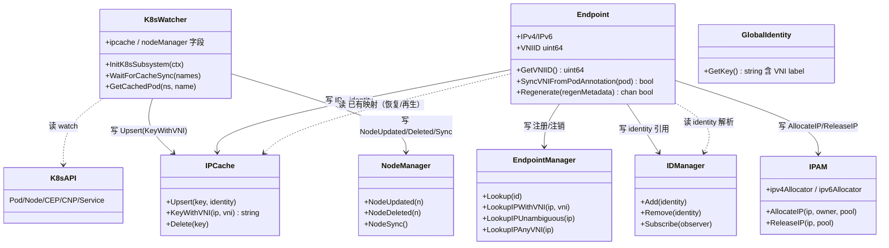
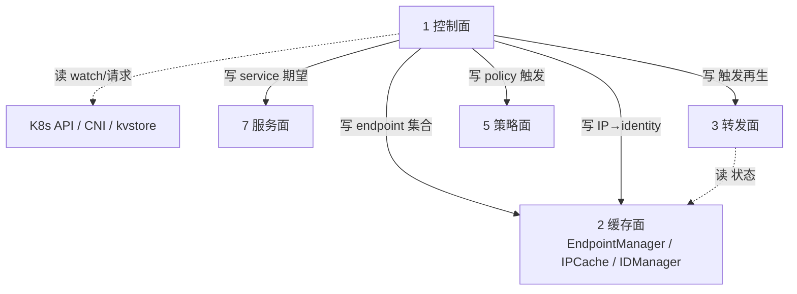

# 第 1 面：控制面（Control Plane）

> 一句话职责：**把外部事实（K8s / CNI / kvstore）翻译成期望状态，驱动 endpoint / identity / IPAM / node / service 配置。**
> 承上启下：承上读外部事实源；启下写缓存面与转发面。

## 1. 定位（文件）

| 范围 | 目录/文件 |
| --- | --- |
| agent 装配边界 | `daemon/cmd/cells.go` → `ControlPlane` module |
| agent 编排 | `daemon/cmd/daemon.go`、`daemon_main.go`、`endpoint_restore.go`、`ipam_init.go` |
| K8s 接入 | `daemon/k8s/`、`pkg/k8s/watchers/`、`pkg/k8s/{informer,resource,slim,apis,synced}` |
| identity | `pkg/identity/identitymanager/`、`pkg/identity/key/` |
| IPAM | `pkg/ipam/`（`types.go`、`allocator/`、`node_manager.go`、`multipool.go`） |
| node | `pkg/node/`、`pkg/nodediscovery/`、`pkg/node/sync/`、`pkg/node/neighbordiscovery/` |
| endpoint 生命周期 | `pkg/endpoint/`（`endpoint.go`、`restore.go`、`regeneration/`） |
| 集群级控制 | `operator/cmd/root.go` → `ControlPlane` module，`operator/` 各控制器 |
| 多集群控制 | `clustermesh-apiserver/`、`pkg/clustermesh/` |
| 控制循环原语 | `pkg/controller/` |

> 说明：`pkg/policy`、`pkg/loadbalancer`、`pkg/proxy`、`pkg/envoy`、`pkg/egressgateway`
> 在 hive 里挂在 agent 的 `ControlPlane` module 下，但按业务内聚它们属于**策略面 / 服务面 / 加密面**，
> 控制面只负责「触发与编排」，不拥有这些面的状态。归属判定看**谁写状态**，不看挂在哪个 module。

## 2. 对象模型

> 图例：实线=写（写者→被写对象）；虚线=读（读者→数据源）。
> **打磨修正**：控制面已 hive 化，无 `Daemon struct`——编排是 `configureDaemon(ctx, daemonParams)`（依赖由 hive 注入），
> 启动拒绝是 `nativeVPCDatapathCompatibility(daemonConfigParams)`；`podVNI()`/`ciliumEndpointVNI()` 是 `pkg/k8s/watchers` 包级自由函数，非 `K8sWatcher` 方法。
> `EndpointManager`、`IPCache`、`IDManager` 是**缓存面**持有的共享状态对象；
> 控制面里的 `Endpoint`/`K8sWatcher`/`IPAM` 是这些对象的**写者**。这就是「控制面写、缓存面持有」。

## 3. 状态所有权

控制面**写**以下期望状态（写者即归属）：

| 状态 | 写入对象 | 去向 |
| --- | --- | --- |
| endpoint 集合 | `Endpoint` / `EndpointManager` | 缓存面 |
| endpoint 标识（含 `vni-ipv4:<vni>:<ip>`） | `endpoint/id` | 缓存面索引 |
| IP→identity 映射（含 `ip@vni:<vni>` key） | `Endpoint` → `IPCache` | 缓存面 |
| numeric identity（含 VNI label） | `IDManager` / allocator | 缓存面 |
| IP 分配 | `IPAM` | 缓存面（ipcache/endpoint） |
| 节点拓扑 | `NodeManager` / `nodediscovery` | 缓存面 |
| service 期望配置 | `loadbalancer` 触发 | 服务面 |

## 4. 读者/写者矩阵（承上启下）

| 方向 | 读/写 | 对象 | 状态 | 用途 |
| --- | --- | --- | --- | --- |
| 承上（读） | 读 | K8s API server | Pod/Node/CEP/CNP/Service | 发现期望事实 |
| 承上（读） | 读 | CNI 请求 | 容器 ID / netns / 网卡 | 创建 endpoint |
| 承上（读） | 读 | kvstore | identity / ipcache / service | 多集群/非 K8s 事实 |
| 启下（写） | 写 | `IPCache` | IP→identity | 供转发面/策略面读取 |
| 启下（写） | 写 | `EndpointManager` | endpoint 索引 | 供 DNS/Hubble/转发面查找 |
| 启下（写） | 写 | `IDManager` | identity 引用 | 供策略面/缓存面读取 |
| 启下（写） | 写 | `IPAM` 分配表 | IP 归属 | 供 endpoint/缓存面读取 |
| 启下（写） | 写 | `NodeManager` | 节点拓扑 | 供转发面/缓存面读取 |

## 5. 层间概览（聚焦控制面）

## 6. (VNI, IP) 完备性判定：✅

结论：控制面**已 VNI 化**。它能把 `(VNI, IP)` 作为一等状态传入缓存面。

| 环节 | 证据 | 机制 |
| --- | --- | --- |
| endpoint 标识 | `pkg/endpoint/id/id.go` | `vni-ipv4:<vni>:<ip>` / `vni-ipv6:<vni>:<ip>` 前缀，`NewVNIIPPrefixID` |
| endpoint 对象 | `pkg/endpoint/endpoint.go` | `Endpoint.VNIID` 字段 + `GetVNIID()` |
| identity 不塌缩 | `pkg/identity/key/vni_key_test.go`、`pkg/labels/labels.go` | identity label 注入 `vni:io-cilium-native-vpc-vni`，两 VPC 同标签同 IP 不共享 identity |
| CEP 传播 | `pkg/k8s/factory_functions.go` + `_vni_test.go` | `TransformToCiliumEndpoint` 保留 VNI annotation |
| watcher 提取 | `pkg/k8s/watchers/native_vpc_vni_test.go` | `podVNI()` / `ciliumEndpointVNI()` 从 annotation 提取 VNI |
| ipcache 写 key | `pkg/ipcache/ipcache.go` | `KeyWithVNI(ip, vni)` → `ip@vni:<vni>` |
| 启动即拒绝 ❌ 面 | `daemon/cmd/daemon.go` | `nativeVPCDatapathCompatibility` 拒绝 KPR/socketLB/egress/SRv6/VTEP/BPF masq/IPsec/WG |

## 7. 边界与风险

- **边界**：`pkg/policy`、`pkg/loadbalancer`、`pkg/proxy/envoy` 虽挂在 hive `ControlPlane` module，
  但状态归属在策略面/服务面。控制面只做触发编排，**不越界写它们的内部状态**。
- **风险 1**：`EndpointManager` 同时承担控制面（GC、再生）与缓存面（索引），
  这是控制/缓存两面的耦合点，后续打磨要在对象级别拆开。
- **风险 2**：operator 侧控制面（集群级 GC/控制器）同样写缓存面，
  但读写链跨进程，VNI 语义靠 CEP annotation 传播，需在缓存面/装配面交叉核对。

## 8. 组件补全：operator / clustermesh 侧控制面对象

> 层 1（控制面）跨三个组件：daemon agent、operator、clustermesh-apiserver。前面对象模型只列了 agent 侧，这里补 operator/clustermesh 侧（它们也是层 1 的核心对象）。

| 对象 | 职责 | (VNI,IP) 立场 | 文件 |
| --- | --- | --- | --- |
| `identitygc.GC` | identity 垃圾回收（按 usage，不重算 labels） | ✅ 安全（identity 键，不碰裸 IP） | `operator/identitygc/gc.go` |
| `ciliumidentity` 控制器 | 管理 CiliumIdentity CRD | ❌ 启动即拒（从 pod/ns labels 派生 identity，不知 VNI annotation） | `operator/pkg/ciliumidentity` |
| `ciliumendpointslice` 控制器 | 管理 CES | ❌ 启动即拒（`CoreCiliumEndpoint` 无法携带 VNI） | `operator/pkg/ciliumendpointslice` |
| `endpointgc.GC` | 回收泄漏的 CiliumEndpoint | ✅ 安全（CEP 带 VNI annotation） | `operator/endpointgc/gc.go` |
| `endpointslicegc` | CES 特性关闭时一次性 GC | ✅ 流程性 | `operator/endpointslicegc` |
| `unmanagedpods` | 重启无 CEP 的 pod | ✅ 流程性 | `operator/unmanagedpods` |
| `policyderivative` | CNP/CCNP 派生策略 | ✅ 经 identity | `operator/policyderivative` |
| `lbipam` / `nodeipam` | LB / Node IPAM | ✅ 集群级（非 pod 裸 IP） | `operator/pkg/lbipam`、`operator/pkg/nodeipam` |
| `gatewayapi` / `ingress` | Gateway API / Ingress 控制器 | ✅ 前端/配置（非 pod 裸 IP） | `operator/pkg/gateway-api`、`operator/pkg/ingress` |
| `bgp` | BGP 控制面 | ✅ 节点/peer（非 pod 裸 IP） | `operator/pkg/bgp` |
| `cmoperator` / `endpointslicesync` / `mcsapi` / `networkpolicy` | 多集群服务/策略同步 | ✅ 集群级 | `operator/pkg` |
| `secretsync` / `ztunnel` / `ciliumenvoyconfig` | TLS 同步 / zTunnel / CEC | ✅ 配置类 | `operator/pkg/secretsync`、`operator/pkg/ztunnel` |

> 关键：operator 侧两个对象在 native-vpc 下**启动即拒**（`ciliumidentity`、`ciliumendpointslice`），
> 因为它们无法携带 VNI；其余对象要么是 identity/集群级键（安全），要么是流程/配置类（不受影响）。

## 9. 承上启下一句话

> 控制面**读** K8s/CNI/kvstore 的「事实」，**写**缓存面的「共享真相」，
> 把 `(VNI, IP)` 从一开始就编码进 endpoint 标识、identity label 与 ipcache key。
