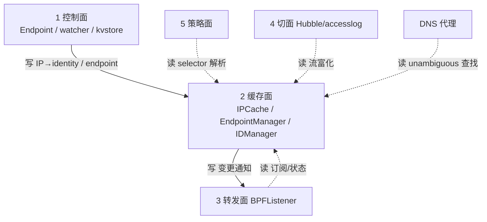

# 第 2 面：缓存面（Cache Plane）

> 一句话职责：**内存中的共享真相。控制面写、转发面/切面/策略面读，是期望状态与已应用状态之间的缓冲。**
> 承上启下：承上**收**控制面的期望状态写；启下**供**转发面/切面/策略面状态读，并向订阅者推送变更事件。

## 1. 定位（文件）

| 范围 | 目录/文件 | 说明 |
| --- | --- | --- |
| IP→identity 缓存 | `pkg/ipcache/ipcache.go` | 核心缓存，含 `KeyWithVNI`、`Identity.Vni`、unambiguous 读 API |
| ipcache 订阅接口 | `pkg/ipcache/listener.go` | `IPIdentityMappingListener` 变更通知 |
| ipcache kvstore 同步 | `pkg/ipcache/kvstore.go` | kvstore ↔ ipcache，VNI-scoped key |
| endpoint 注册表/索引 | `pkg/endpointmanager/manager.go` | endpoint 多索引查找（含 VNI 索引） |
| identity 引用缓存 | `pkg/identity/identitymanager/manager.go` | identity 引用计数 |
| identity 分配缓存 | `pkg/identity/cache/cache.go`、`allocator.go` | identity ↔ labels 缓存 |
| policy 仓储 | `pkg/policy/repository.go`、`selectorcache.go` | policy 规则/selector 缓存（策略面持有，见边界） |
| DNS 缓存 | `pkg/fqdn/cache.go` | FQDN→IP 缓存 |
| 节点缓存 | `pkg/node/manager/` | 其它节点状态 |
| 服务缓存 | `pkg/loadbalancer/` | service/frontend/backend（服务面持有） |
| 通用内存表 | `pkg/k8s/statedb.go`、`pkg/datapath/tables/` | stateDB 表 |

## 2. 对象模型

```mermaid
classDiagram
    class IPCache {
        +ipToIdentityCache map[string]Identity
        +identityToIPCache map[ID]map[string]struct{}
        +ipToVNIKeys map[string]map[string]struct{}
        +listeners []IPIdentityMappingListener
        +Upsert(key, identity)
        +KeyWithVNI(ip, vni) string
        +LookupSecIDByIPForVNI(ip, vni)
        +LookupSecIDByIPUnambiguous(ip)
        +GetK8sMetadataUnambiguous(ip)
    }
    class Identity {
        +ID NumericIdentity
        +Vni uint32
        +Source
    }
    class EndpointManager {
        +endpoints map[string]*Endpoint
        +LookupIPWithVNI(ip, vni)
        +LookupIPUnambiguous(ip)
        +LookupIPAnyVNI(ip)
        +lookupVNIIPv4/6
    }
    class IDManager {
        +identities map[ID]*identityMetadata
        +Add / Remove / Subscribe
    }
    class CachingIdentityAllocator {
        +GetIdentityCache()
        +AllocateIdentity(ctx, lbls, notify, oldNID)
        +Release(ctx, id, notify)
    }
    class BPFListener {
        +OnIPIdentityCacheChange(mod, prefix, old, new, ...)
    }
    class Endpoint {
        +VNIID uint64
    }
    class IPIdentitySynchronizer {
        +Upsert(params) / Delete(ip, vni)
    }
    class DNSProxy {
        +LookupEndpointByIP(ip)
    }
    class EndpointResolver {
        +LookupSecIDByIPForVNI(ip, vni)
        +GetK8sMetadataForVNI(ip, vni)
    }

    Endpoint --> IPCache : 写 Upsert
    IPIdentitySynchronizer --> IPCache : 写 Upsert
    Endpoint --> EndpointManager : 写 注册/注销
    Endpoint --> IDManager : 写 identity 引用
    Endpoint --> CachingIdentityAllocator : 写 分配 identity

    IPCache o-- Identity : 持有（值）
    IPCache --> BPFListener : 写 通知 OnIPIdentityCacheChange
    BPFListener ..> IPCache : 读 订阅
    DNSProxy ..> EndpointManager : 读 LookupIPUnambiguous
    DNSProxy ..> IPCache : 读 LookupSecIDByIPUnambiguous
    EndpointResolver ..> IPCache : 读 VNI-scoped 身份/元数据
```

> 图例：实线=写（写者→被写对象）；虚线=读（读者→数据源）；`o--`=持有（非数据）。
> 缓存面对象的「主写者」几乎都在控制面；缓存面自身的写只有两件事：**维护二级索引**、**向订阅者推送变更**。

## 3. 状态所有权

缓存面**持有**（holds）这些共享状态；主写者是控制面，缓存面负责一致性索引与通知：

| 状态 | 持有者 | 主写者（来自） | 缓存面自身的写 |
| --- | --- | --- | --- |
| IP→identity 映射 | `IPCache` | 控制面 Endpoint / watcher / kvstore | 维护 `ipToVNIKeys`、`identityToIPCache` 反查；通知 listener |
| endpoint 索引 | `EndpointManager` | 控制面 Endpoint | 维护 vni-ipv4/vni-ipv6 等多索引 |
| identity 引用计数 | `IDManager` | 控制面 Endpoint | refCount 增减 |
| identity↔labels | `CachingIdentityAllocator` | 控制面 allocator | ForeachCache 快照 |

## 4. 读者/写者矩阵（承上启下）

| 方向 | 读/写 | 对象 | 状态 | 用途 |
| --- | --- | --- | --- | --- |
| 承上（被写） | 写 | 控制面 Endpoint | endpoint 集合 / IP→identity | 注册/注销 |
| 承上（被写） | 写 | 控制面 watcher | IP→identity（CIDR/CEP） | 同步 K8s 事实 |
| 承上（被写） | 写 | kvstore synchronizer | IP→identity（VNI key） | 多集群/CRD 模式 |
| 启下（被读） | 读 | 转发面 `BPFListener` | IP→identity 变更 | 同步 BPF map |
| 启下（被读） | 读 | 策略面 selector 解析 | IP→identity / policy 缓存 | 算 identity 规则 |
| 启下（被读） | 读 | 切面 Hubble / accesslog | IP→identity / endpoint | 流富化 |
| 启下（被读） | 读 | DNS 代理 | endpoint 索引（unambiguous） | DNS 回包归属 |
| 启下（写通知） | 写 | 转发面 / 切面订阅者 | 变更事件 | 触发同步/富化 |

## 5. 层间概览（聚焦缓存面）



## 6. (VNI, IP) 完备性判定：✅

结论：缓存面**已 VNI 化**。`(VNI, IP)` 能作为一等 key 在共享状态里共存，且裸 IP 读 API 在 VNI 重叠时**fail closed（宁可 miss，不猜 VNI）**。

| 环节 | 证据 | 机制 |
| --- | --- | --- |
| ipcache key | `pkg/ipcache/ipcache.go` | `KeyWithVNI(ip, vni)` → `ip@vni:<vni>`；`Identity.Vni` 字段 |
| VNI 共存 | `pkg/ipcache/vni_test.go` | 同 IP 不同 VNI → 两个独立 entry，各带 identity+VNI |
| VNI 精确读 | `pkg/ipcache/ipcache.go` | `LookupSecIDByIPForVNI` / `GetK8sMetadataForVNI`（key-exact） |
| 裸 IP 读 fail closed | `pkg/ipcache/ipcache.go` | `LookupSecIDByIPUnambiguous` / `GetK8sMetadataUnambiguous`，`ipToVNIKeys` 多 VNI 时 miss |
| kvstore 往返 | `pkg/ipcache/kvstore.go` + `kvstore_vni_test.go` | kvstore key 带 VNI，watcher 以 `ip@vni` 重插，不再塌缩成裸 IP |
| endpoint 索引 | `pkg/endpointmanager/manager.go` + `vni_lookup_test.go` | `LookupIPWithVNI` / `LookupIPUnambiguous` / `LookupIPAnyVNI` |
| CEP 写回 | `pkg/endpointmanager/endpointsynchronizer_vni_test.go` | VNI annotation JSON Pointer 转义，避免 CEP patch 失败 |
| DNS 回包归属 | `pkg/fqdn/dnsproxy/restored_eps_vni_test.go` | 同 IP 多 VNI 时 fail closed |

## 7. 边界与风险

- **边界**：`pkg/policy/repository.go`、`pkg/loadbalancer/`、`pkg/fqdn/cache.go` 也是「缓存」，
  但状态归属在策略面/服务面/策略面，缓存面只是引用，不拥有其语义。
- **风险 1**：`EndpointManager` 包同时含 `manager.go`（缓存索引）与 `endpointsynchronizer.go`（写 CEP 到 K8s），
  是控制/缓存耦合点，与第 1 面风险 1 呼应，打磨时要按对象拆。
- **风险 2**：`LookupSecIDByIPUnambiguous` 是「最佳努力」读 API，文档明确**禁止**写者/通用路径使用，
  否则裸 IP 写与 VNI 写会互相污染——这是缓存面最重要的正确性红线。
- **风险 3**：stateDB 通用表（`pkg/datapath/tables`、`pkg/k8s/statedb.go`）是新兴的缓存形态，
  VNI 语义尚未系统覆盖，后续需与 ipcache/endpointmanager 的 VNI 约定对齐。

## 8. 承上启下一句话

> 缓存面**收**控制面写的 `(VNI, IP)` 期望状态，**供**转发面/切面/策略面按 VNI 精确读，
> 并在 VNI 重叠时对裸 IP 读 fail closed——它是 `(VNI, IP)` 语义最核心的守卫层。

## 9. 互链：对象模型 ↔ 层间概览 ↔ 路

- 本层对象模型见 §2，层间概览见 §5；层边界与顶层 API 见 [00-overview.md](00-overview.md)。
- 经过本层的路：[ip-to-identity](../road/ip-to-identity.md)、[vni-ip-to-identity](../road/vni-ip-to-identity.md)、[cep-vni-propagation](../road/cep-vni-propagation.md)、[endpoint-restore](../road/endpoint-restore.md)。
- 完备性账本见 [completeness.md](completeness.md)，待完善点见 [todo.md](todo.md)。
