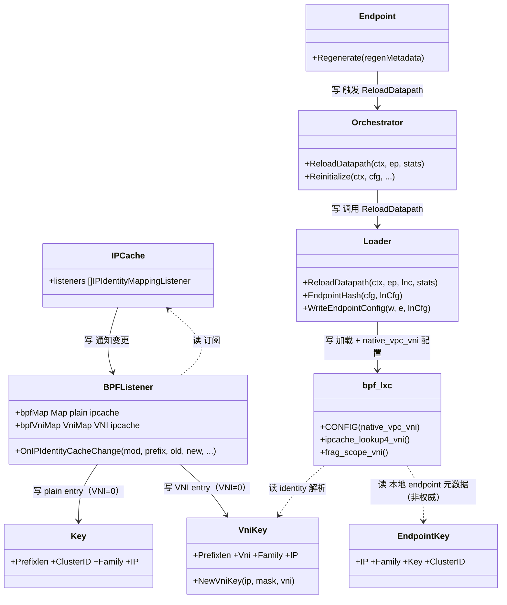
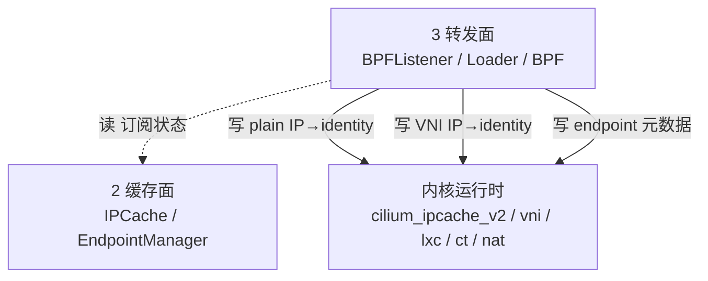

# 第 3 面：转发面（Datapath / Forwarding Plane）

> 一句话职责：**把缓存面的共享真相落到内核 BPF / 路由 / iptables，是唯一触碰内核运行时状态的执行者。**
> 轴定位：轴1=转发（阶段）；各特性域的执行段均落在此面。
> 承上启下：承上**读**缓存面状态（订阅 ipcache 变更）；启下**写**内核运行时状态（maps / ct / nat / route）。

## 1. 定位（文件）

| 范围 | 目录/文件 | 说明 |
| --- | --- | --- |
| BPF 程序 | `bpf/*.c`、`bpf/lib/*.h` | 实际 datapath（lxc/host/overlay/xdp） |
| VNI ipcache 查找 | `bpf/lib/eps.h` | `cilium_ipcache_vni` map + `ipcache_lookup4/6_vni` |
| VNI 分片作用域 | `bpf/lib/ipv4.h` | `struct ipv4_frag_id.vni`，fail-closed |
| loader | `pkg/datapath/loader/` | 编译/加载 BPF，per-endpoint 配置 `native_vpc_vni` |
| ipcache→BPF 同步 | `pkg/datapath/ipcache/listener.go` | `BPFListener`，VNI 路由到 VNI map |
| BPF map 封装 | `pkg/maps/`（ipcache/lxcmap/ctmap/nat/policymap） | 用户态访问 BPF map |
| ipcache map key | `pkg/maps/ipcache/ipcache.go` | `Key`（plain）/ `VniKey`（VNI） |
| lxc map | `pkg/maps/lxcmap/lxcmap.go` | `cilium_lxc`（本地 endpoint 元数据，非权威） |
| endpoint 再生 | `pkg/endpoint/bpf.go`、`pkg/endpoint/regeneration/` | 触发 BPF 重载 |
| 内核落地 | `pkg/datapath/linux/`、`pkg/datapath/{connector,iptables,tunnel,node}` | sysctl/ipsec/route/邻居 |

## 2. 对象模型

> 图例：实线=写；虚线=读。**打磨修正**：`Loader` 是接口（`pkg/datapath/types/loader.go`，实现 `loader`），
> 方法为 `ReloadDatapath`（非 `compileAndLoad`）；`bpf_lxc` 是 BPF 程序（`bpf/bpf_lxc.c`），不是 Go 对象。
> **本轮修正**：Endpoint 不直接写 Loader，而是经 `Orchestrator`（`pkg/datapath/orchestrator`）→ `Loader`；补入 `Orchestrator` 对象。
> 关键：`cilium_lxc`（`EndpointKey`）按裸 IP 键，**非权威**；VNI 场景的 identity 解析走 `VniKey`。

## 3. 状态所有权

转发面**写**内核运行时状态（执行者）：

| 状态 | 写入者 | 内核载体 |
| --- | --- | --- |
| IP→identity（plain） | `BPFListener` | `cilium_ipcache_v2` |
| IP→identity（VNI） | `BPFListener` | `cilium_ipcache_vni` |
| 本地 endpoint 元数据 | endpoint 再生 | `cilium_lxc` |
| conntrack 五元组 | BPF datapath | ctmap |
| NAT 映射 | BPF datapath | nat map |
| 策略执行位图 | policy 下发 | policymap |
| 路由/邻居/iptables | `pkg/datapath/*` | Linux 网络栈 |

## 4. 读者/写者矩阵（承上启下）

| 方向 | 读/写 | 对象 | 状态 | 用途 |
| --- | --- | --- | --- | --- |
| 承上（读） | 读 | 缓存面 `IPCache` | IP→identity 变更 | 同步 BPF map |
| 承上（读） | 读 | 缓存面 `EndpointManager` | endpoint 元数据 | 再生/装配 |
| 承上（读） | 读 | 策略面 policymap 规则 | 编译后策略 | 下发 BPF |
| 启下（写） | 写 | `cilium_ipcache_v2/vni` | IP→identity | 供 BPF 查身份 |
| 启下（写） | 写 | `cilium_lxc` | endpoint 元数据 | 本地转发 |
| 启下（写） | 写 | ctmap/nat map | 五元组/NAT | 有状态转发 |
| 启下（写） | 写 | Linux 路由/邻居/iptables | 转发路径 | 路由/策略 |

## 5. 层间概览（聚焦转发面）

## 6. (VNI, IP) 完备性判定：✅（cilium_lxc 非权威）

结论：转发面**已 VNI 化**，权威的 VNI 身份解析走 `cilium_ipcache_vni`（键 = VNI+IP）；
`cilium_lxc` 按裸 IP 键，仅存本地 endpoint 元数据，**不是** VNI 身份解析的权威来源。

| 环节 | 证据 | 机制 |
| --- | --- | --- |
| VNI ipcache map | `bpf/lib/eps.h` | `cilium_ipcache_vni` + `struct ipcache_vni_key`（LPM key 含 vni） |
| VNI 查找函数 | `bpf/lib/eps.h` | `ipcache_lookup4_vni` / `ipcache_lookup6_vni` |
| Go 侧 key 对齐 | `pkg/maps/ipcache/ipcache.go` | `VniKey` 与 `struct ipcache_vni_key` 布局一致 |
| VNI 路由 | `pkg/datapath/ipcache/listener.go` + `listener_vni_test.go` | `Vni≠0` 写 vni map，`Vni=0` 写 plain map |
| 分片 VNI 作用域 | `bpf/lib/ipv4.h` | `ipv4_frag_id.vni`，`frag_scope_vni()` 仅 bpf_lxc 填 VNI |
| fail-closed 丢弃 | `bpf/lib/ipv4.h`、`drop_reasons.h` | 跨程序分片 miss → `DROP_FRAG_NOT_FOUND`；`DROP_INVALID_VNI` |
| 非权威 lxc | `pkg/maps/lxcmap/lxcmap.go` | `EndpointKey` 只含 `IP/Family/Key/ClusterID`，无 VNI |
| bpf_lxc 感知 VNI | `bpf/lib/ipv4.h`、per-endpoint 配置 | `CONFIG(native_vpc_vni)` 是 per-endpoint 加载期配置 |

## 7. 边界与风险

- **边界**：`pkg/endpoint/bpf.go`、`pkg/endpoint/regeneration/` 横跨控制面与转发面；
  「再生」是控制面决策，但「写 BPF」是转发面执行，打磨时按动作归属拆分。
- **风险 1（cilium_lxc 非权威）**：`cilium_lxc` 按裸 IP 键，native-vpc 重叠 IP 下两 VPC 会碰撞，
  因此它只能做本地元数据，身份解析必须强制走 `cilium_ipcache_vni`。任何绕过 VNI map 的 lxc 读都是 bug。
- **风险 2**：分片表跨程序（bpf_lxc 与非 bpf_lxc）用不同 VNI 作用域，靠 fail-closed 兜底；
  这依赖「native-vpc 下 pod 路径只有 bpf_lxc」的前提（kube-ovn 拥有 host/tunnel datapath）。
- **风险 3**：ctmap/nat 仍按裸五元组键（第 6 面 ❌），转发面能做的只是把 VNI 编码进分片 key，
  真正的五元组 VNI 化要在 CT/NAT 面解决。

## 8. 承上启下一句话

> 转发面**读**缓存面的 `(VNI, IP)` 状态，**写**内核 `cilium_ipcache_vni` 完成 VNI 身份解析；
> `cilium_lxc` 非权威，权威路径只有一条——VNI map。

## 9. 互链：对象模型 ↔ 层间概览 ↔ 路

- 本层对象模型见 §2，层间概览见 §5；层边界与顶层 API 见 [00-overview.md](00-overview.md)。
- 经过本层的路：[ip-to-identity](../road/ip-to-identity.md)、[vni-ip-to-identity](../road/vni-ip-to-identity.md)、[cnp-to-policymap](../road/cnp-to-policymap.md)、[cep-vni-propagation](../road/cep-vni-propagation.md)、[service-clusterip-to-backend](../road/service-clusterip-to-backend.md)、[fragment-vni-scope](../road/fragment-vni-scope.md)、[mutual-auth](../road/mutual-auth.md)、[endpoint-restore](../road/endpoint-restore.md)。
- 完备性账本见 [completeness.md](completeness.md)，待完善点见 [todo.md](todo.md)。
