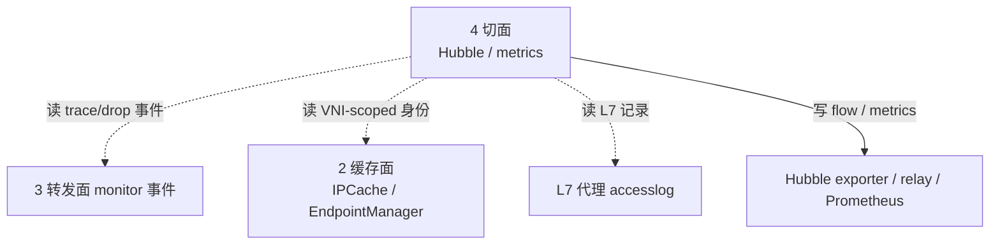

# 第 4 面：切面（可观察性 / Observability）

> 一句话职责：**观察转发结果与缓存状态，输出 flow / metrics / log，本身不写业务状态。**
> 承上启下：承上**读**转发面的 monitor 事件、缓存面的共享状态、L7 代理的 accesslog；启下**写**自己的导出产物（flow / metrics / 日志）。

## 1. 定位（文件）

| 范围 | 目录/文件 | 说明 |
| --- | --- | --- |
| Hubble 管线 | `pkg/hubble/`（observer/server/metrics/exporter/parser/filters） | flow 采集与导出 |
| 事件源 | `pkg/monitor/`（agent/notifications/dissect/datapath_*） | monitor 事件解析 |
| L3/L4 解析 | `pkg/hubble/parser/threefour/` | trace notify → flow |
| L7 解析 | `pkg/hubble/parser/seven/` | accesslog → flow |
| 端点解析 | `pkg/hubble/parser/common/` | endpoint/identity 富化 |
| 指标 | `pkg/metrics/`、`pkg/metrics/features/` | Prometheus 指标 |
| flow 契约 | `api/v1/flow/flow.proto` | `Endpoint.vni_id`、`IPCacheNotification.vni` |
| L7 记录 | `pkg/proxy/accesslog/record.go` | `EndpointInfo.VNIID` |
| 状态/健康 | `pkg/status/`、`pkg/health/`、`cilium-health/` | 状态与连通性 |
| 调试 | `pkg/flowdebug/`、`pkg/spanstat/`、`pkg/debug/`、`pkg/pprof/` | 调试辅助 |
| 中继 | `hubble-relay/` | 集群级 flow 汇聚 |

## 2. 对象模型

```mermaid
classDiagram
    class MonitorAgent {
        +Subscribe() / SendEvent()
    }
    class LocalObserverServer {
        +GetEventsChannel()
        +Run()
    }
    class Parser {
        +Decode(monitorEvent)
    }
    class ThreeFourParser {
        +DecodeTraceNotify()
    }
    class SevenParser {
        +DecodeLogRecord()
    }
    class EndpointResolver {
        +ResolveEndpoint(ip, identity, ctx)
    }
    class IPCache {
        +LookupSecIDByIPForVNI(ip, vni)
        +GetK8sMetadataForVNI(ip, vni)
    }
    class EndpointManager {
        +LookupIPWithVNI(ip, vni)
        +LookupIPUnambiguous(ip)
    }
    class LogRecord {
        +EndpointInfo.VNIID
    }
    class Flow {
        +Endpoint.vni_id
        +IPCacheNotification.vni
    }
    class ContextOptions {
        +GetLabelNames()
        +GetLabelValues(flow)
    }

    LocalObserverServer ..> MonitorAgent : 读 订阅事件
    LocalObserverServer --> Parser : 写 调 Decode
    Parser --> ThreeFourParser : 写 分派
    Parser --> SevenParser : 写 分派
    ThreeFourParser ..> EndpointManager : 读 local endpoint VNI
    EndpointResolver ..> IPCache : 读 VNI-scoped 身份/元数据
    SevenParser ..> LogRecord : 读 L7 记录（VNIID）
    ThreeFourParser --> Flow : 写 flow.vni_id
    SevenParser --> Flow : 写 flow.vni_id
    Flow ..> ContextOptions : 读 生成 vni 标签
    ContextOptions --> Prometheus : 写 vni 指标标签
```

> 图例：实线=写；虚线=读。**打磨修正**：`MonitorAgent` 实际是接口 `monitor/agent.Agent`；
> `ThreeFourParser`/`SevenParser` 实际类型分别是 `threefour.Parser`/`seven.Parser`（同名不同包，故用前缀区分）；
> `Flow` 是 `api/v1/flow` 生成类型；`ContextOptions` 是 `pkg/hubble/metrics/api` 的类型。
> **本轮修正**：补入 `LocalObserverServer`（`pkg/hubble/observer`）与 `Parser`(Decoder)（`pkg/hubble/parser`）；
> 真实链是 MonitorAgent → LocalObserverServer → Parser(Decoder) → ThreeFour/SevenParser（不是 parser 直接读 MonitorAgent）。
> 切面对业务状态是**纯读者**，唯一的「写」是写自己的导出产物。

## 3. 状态所有权

切面**不拥有**业务状态，只写导出产物：

| 状态 | 写入者 | 去向 |
| --- | --- | --- |
| flow 记录（含 `vni_id`） | Hubble parser | hubble observer/relay/exporter |
| Prometheus 指标（含 vni 标签） | `pkg/metrics` | Prometheus |
| accesslog 富化结果 | L7 parser | flow |
| 健康/状态 | `pkg/status`、`pkg/health` | API/日志 |

## 4. 读者/写者矩阵（承上启下）

| 方向 | 读/写 | 对象 | 状态 | 用途 |
| --- | --- | --- | --- | --- |
| 承上（读） | 读 | 转发面 monitor | trace/drop/debug 事件 | flow 采集 |
| 承上（读） | 读 | 缓存面 `IPCache` | VNI-scoped 身份/元数据 | 端点富化 |
| 承上（读） | 读 | 缓存面 `EndpointManager` | local endpoint VNI | 定 flow 归属 |
| 承上（读） | 读 | 策略面/代理 accesslog | L7 记录（VNIID） | L7 flow |
| 启下（写） | 写 | Hubble exporter/relay | flow（vni_id） | 导出 |
| 启下（写） | 写 | Prometheus | vni 标签指标 | 监控 |

## 5. 层间概览（聚焦切面）

## 6. (VNI, IP) 完备性判定：✅

结论：切面**已 VNI 化**。flow/指标/accesslog 都能携带 VNI，且富化路径走 VNI-scoped 精确查找，不在裸 IP 上猜 VNI。

| 环节 | 证据 | 机制 |
| --- | --- | --- |
| flow 契约 | `api/v1/flow/flow.proto` | `Endpoint.vni_id`(field 8)、`IPCacheNotification.vni`(field 9) |
| wire 兼容 | `api/v1/flow/vni_proto_test.go` | protobuf marshal/unmarshal 保 VNI，旧字段号不变 |
| 端点富化 | `pkg/hubble/parser/common/endpoint_vni_test.go` | 从 identity 的 VNI label 派生 VNI → `GetK8sMetadataForVNI` 精确查 |
| L3/L4 链 | `pkg/hubble/parser/threefour/vni_test.go` | datapath 事件(local id) → local VNI → `(VNI,IP)` 精确查 → 双端点 `vni_id` |
| L7 链 | `pkg/hubble/parser/seven/vni_test.go` | accesslog `VNIID` → `GetK8sMetadataForVNI` → flow `vni_id` |
| accesslog 契约 | `pkg/proxy/accesslog/record.go` | `EndpointInfo.VNIID`，零值=非 VPC |
| 指标上下文 | `pkg/hubble/metrics/api/context_vni_test.go` | `vni` / `source_vni` / `destination_vni` 标签，非 VPC 回落 ip |

## 7. 边界与风险

- **边界**：`pkg/monitor/` 既是转发面的「事件出口」，也是切面的「事件入口」，
  归属上 monitor 的事件**产生**在转发面，**消费**在切面；切面不拥有事件源。
- **风险 1**：富化依赖「identity 带 VNI label」这一前提（第 1 面保证）。
  若 identity label 丢失，裸 IP 富化会 miss 而非错配——fail-closed，可接受但需监控覆盖率。
- **风险 2**：metrics 的 `vni` 标签是可选上下文，未默认开启；
  排查 VPC 重叠流时必须显式启用 `source_vni/destination_vni`，否则两 VPC 序列会塌缩成同一条。
- **风险 3**：L7 accesslog 的 `VNIID` 由代理填写，若代理侧（Envoy/DNS）未透传 VNI，
  L7 flow 会退化为裸 IP，需在策略面/L7 边界交叉核对。

## 8. 承上启下一句话

> 切面**读**转发面事件与缓存面的 `(VNI, IP)` 状态，**写**带 `vni_id` 的 flow 与带 vni 标签的指标，
> 让两个 VPC 共享同一 IP 的流量在可观察性维度仍然可区分。

## 9. 组件补全：hubble-relay

层 4（切面）跨两个组件：daemon agent（Hubble server/observer）与 **hubble-relay**（独立二进制，集群级 flow 汇聚）。

| 对象 | 职责 | (VNI,IP) 立场 | 文件 |
| --- | --- | --- | --- |
| `relay/server.Server` | 聚合各节点 Hubble，对外 gRPC | ✅ 转发 flow（`vni_id` 透传） | `pkg/hubble/relay/server/server.go` |
| `healthServer` | relay 健康检查 | ✅ 状态 | `pkg/hubble/relay/server/health.go` |

## 10. 互链：对象模型 ↔ 层间概览 ↔ 路

- 本层对象模型见 §2，层间概览见 §5；层边界与顶层 API 见 [00-overview.md](00-overview.md)。
- 经过本层的路：[ip-to-identity](../road/ip-to-identity.md)、[vni-ip-to-identity](../road/vni-ip-to-identity.md)。（专用切面路待补，见 todo P2）
- 完备性账本见 [completeness.md](completeness.md)，待完善点见 [todo.md](todo.md)。
