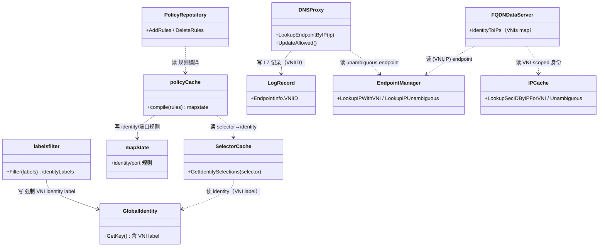

# 第 5 面：策略面（Policy Plane）

> 一句话职责：**把 policy 语义（规则/选择器/L7）编译成 identity/端口规则，供转发面执行。**
> 承上启下：承上**读**控制面写入的 policy 规则、缓存面的 identity（含 VNI label）；启下**写**编译后的 mapstate / selector 结果 / L7 代理规则。

## 1. 定位（文件）

| 范围 | 目录/文件 | 说明 |
| --- | --- | --- |
| policy 语义/编译 | `pkg/policy/`（api/rules/distillery/resolve/selectorcache/mapstate/cookie/groups/directory） | 规则→mapstate |
| policy 源接入 | `pkg/policy/k8s/`、`pkg/policy/directory/` | CNP/CCNP watcher |
| 标签与过滤 | `pkg/labels/`、`pkg/labelsfilter/filter.go` | VNI label 强制为 identity label |
| identity 派生 | `pkg/identity/`、`pkg/identity/key/` | identity key 含 VNI label |
| FQDN 策略 | `pkg/fqdn/`（service/dnsproxy/rules/namemanager） | FQDN→IP（带 VNI） |
| L7 代理 | `pkg/proxy/`、`pkg/envoy/` | L7 规则下发 |
| L7 记录 | `pkg/proxy/accesslog/record.go`、`endpoint/epinfo.go` | accesslog 带 VNIID |
| 认证 | `pkg/auth/` | policy 认证 |

## 2. 对象模型



> 图例：实线=写；虚线=读。**打磨修正**：无 `Distillery` 类型，实际是 `policyCache`（`pkg/policy/distillery.go`）；
> `mapState` 未导出（别名 `MapStateMap`）；`labelsfilter` 是包（函数 `Filter`），非 struct；
> `FQDNDataServer`（`pkg/fqdn/service/service.go`）替代原 `FQDNService`；`GlobalIdentity`/`LogRecord` 与前后面命名对齐。
> **归属澄清**：`labelsfilter` 与 `GlobalIdentity` 归**控制面**（identity 派生管道，`pkg/labelsfilter`/`pkg/identity/key`），
> 策略面只读其结果（`SelectorCache` 读 identity）。策略面「经 identity 天然 VNI 化」依赖控制面把 VNI label 强制保留为 identity label。

## 3. 状态所有权

| 状态 | 持有者 | 说明 |
| --- | --- | --- |
| policy 规则 | `PolicyRepository` | 控制面 watcher 写入 |
| selector→identity | `SelectorCache` | 经 identity 解析 |
| 编译后 mapstate | `mapState` | 供转发面下发 policymap |
| FQDN→IP 映射 | `FQDNDataServer` | 带 `VNIs map` |
| L7 规则 | `DNSProxy` / `Envoy` | 代理执行 |
| accesslog | `LogRecord` | 带 `VNIID` |

## 4. 读者/写者矩阵（承上启下）

| 方向 | 读/写 | 对象 | 状态 | 用途 |
| --- | --- | --- | --- | --- |
| 承上（读） | 读 | 控制面 watcher | CNP/CCNP 规则 | 建 policy 仓储 |
| 承上（读） | 读 | 缓存面 identity | identity（VNI label） | selector 解析 |
| 承上（读） | 读 | 缓存面 `IPCache` / `EndpointManager` | (VNI,IP) 身份 | FQDN/L7 归属 |
| 启下（写） | 写 | `mapState` | identity/端口规则 | 下发转发面 |
| 启下（写） | 写 | `DNSProxy` / `Envoy` | L7 规则 | 代理执行 |
| 启下（写） | 写 | `LogRecord` | VNIID | 供切面富化 |

## 5. 层间概览（聚焦策略面）

```mermaid
flowchart TD
    CP[1 控制面 CNP/CCNP watcher]
    ID[缓存面 identity<br/>含 VNI label]
    IP[缓存面 IPCache/EndpointManager<br/>(VNI,IP)]
    POL[5 策略面<br/>repository/distillery/selector]
    DP[3 转发面 policymap]
    L7[L7 代理 Envoy/DNS]

    CP -->|写 规则| POL
    POL -.->|读 identity| ID
    POL -.->|读 (VNI,IP) 身份| IP
    POL -->|写 mapstate| DP
    POL -->|写 L7 规则| L7
```

## 6. (VNI, IP) 完备性判定：经 identity 天然 ✅；CIDR / FQDN / L7 是边界

**主结论**：策略面**经 identity 天然 VNI 化**——VNI 被做成 identity label，
`fromEndpoints/toEndpoints` 选择器自然按 VNI 区分，无需在每个规则里写 VNI。

| 环节 | 证据 | 机制 |
| --- | --- | --- |
| VNI label 定义 | `pkg/labels/labels.go` | `LabelSourceVNI="vni"`、`VNIKey="io-cilium-native-vpc-vni"`（防用户 label 冲突） |
| 强制 identity label | `pkg/labelsfilter/filter.go` | native-vpc 下 VNI label 硬保留为 identity label，不可被 ignore 降级 |
| selector 匹配 | `pkg/policy/api/vni_label_test.go` | `vni:...=36` 只匹配 VNI 36，不同 VNI 不匹配 |
| identity 不塌缩 | `pkg/identity/key/vni_key_test.go` | 同标签同 IP 不同 VNI → 不同 identity key |

### 三个边界

| 边界 | 现状 | 证据 | 为什么是边界 |
| --- | --- | --- | --- |
| CIDR 规则 | 按裸 prefix 选择 | `pkg/policy/cidr.go`（无 VNI） | `toCIDR/fromCIDR` 无法区分同 IP 不同 VNI，需按 VNI-scoped CIDR 扩展 |
| FQDN 规则 | 映射已带 VNI，但 DNS 回包归属靠 unambiguous | `pkg/fqdn/service/service.go`（`identityToIPs.VNIs`） | FQDN→IP 已 VNI 化，但连接级 VNI 未知时 fail-closed |
| L7 代理 | accesslog 带 VNIID，代理需透传 | `pkg/proxy/accesslog/record.go`、`endpoint/epinfo.go` | L7 记录已 VNI 化，但 Envoy/DNS 侧必须正确填 VNIID |

### fail-closed 证据

- `pkg/fqdn/dnsproxy/proxy.go`：`LookupEndpointByIP` 在裸 IP 命中多个 restored endpoint（多 VNI 重叠）时 **不猜 VNI**，宁 miss。
- `pkg/proxy/accesslog/endpoint/epinfo.go`：本地 endpoint 用 `LookupCiliumID`（不按裸 IP），fallback 用 `LookupSecIDByIPUnambiguous`。

## 7. 边界与风险

- **边界 1（CIDR）**：`pkg/policy` 核心（distillery/resolve/mapstate）无 VNI 字段，
  CIDR 规则仍按裸 prefix 匹配。这是策略面唯一「非 identity 路径」的 VNI 盲区。
- **边界 2（FQDN）**：FQDN→IP 已带 VNI（`identityToIPs.VNIs`），但 DNS 代理无法从连接本身得知 VNI，
  只能 fail-closed；这依赖「同 IP 单 VNI 才解析」的假设。
- **边界 3（L7）**：L7 链路的 VNIID 由代理填写，Envoy/DNS 任一侧漏传即退化为裸 IP 富化（切面仍 fail-closed）。
- **风险**：用户 Kubernetes label 若与 `VNIKey` 撞名，可能影响 VNI 注入——已用 Cilium 自有 key + 强制前缀规避（`labelsfilter`），需在装配面做回归门禁。

## 8. 承上启下一句话

> 策略面**读** identity（VNI label）与 `(VNI, IP)` 身份，**写** mapstate 与 L7 规则；
> identity 路径天然 VNI 化，CIDR / FQDN / L7 三个边界用 fail-closed 兜底，是「天然 ✅ + 三处边界」。

## 9. 互链：对象模型 ↔ 层间概览 ↔ 路

- 本层对象模型见 §2，层间概览见 §5；层边界与顶层 API 见 [00-overview.md](00-overview.md)。
- 经过本层的路：[ip-to-identity](../road/ip-to-identity.md)、[vni-ip-to-identity](../road/vni-ip-to-identity.md)、[cnp-to-policymap](../road/cnp-to-policymap.md)、[mutual-auth](../road/mutual-auth.md)。
- 完备性账本见 [completeness.md](completeness.md)，待完善点见 [todo.md](todo.md)。
