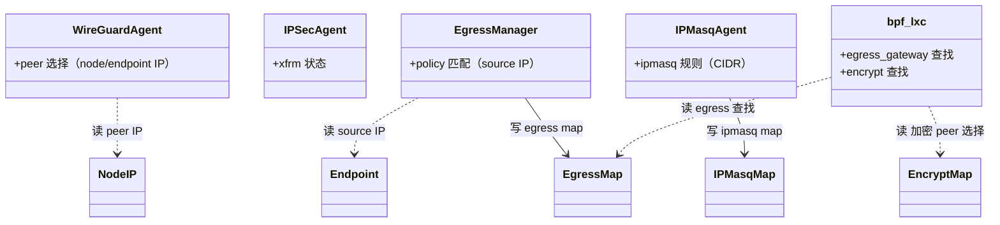
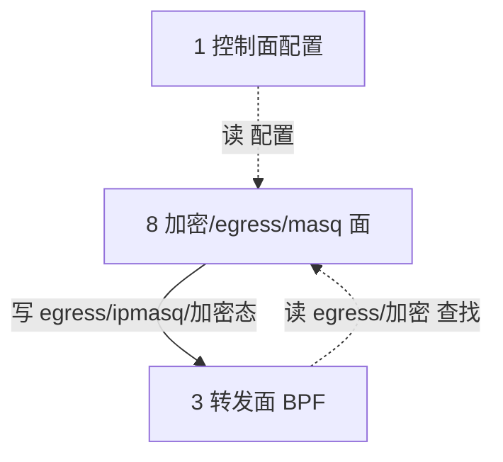

# 第 8 面：加密 / egress gateway / masquerade 面

> 一句话职责：**报文加密、出口网关选路、源地址伪装，都是「按裸 IP 选流量或选对端」的地址键特性。**
> 承上启下：承上**读**控制面写入的加密/egress/masq 配置；启下**写**内核加密态 / egress map / ipmasq map。

## 1. 定位（文件）

| 范围 | 目录/文件 | 说明 |
| --- | --- | --- |
| WireGuard | `pkg/wireguard/`（agent/types） | WG 设备与 peer 管理 |
| IPsec | `pkg/datapath/linux/ipsec/`、`pkg/maps/encrypt/` | xfrm + 加密 key map |
| egress gateway | `pkg/egressgateway/`（manager/policy/endpoint） | 出口源地址选择 |
| masquerade | `pkg/ipmasq/`、`pkg/maps/ipmasq/` | 源地址伪装 |
| datapath 逻辑 | `bpf/lib/ipsec.h`、`bpf/lib/egress_gateway.h`、`bpf/lib/encrypt.h` | BPF 侧 |
| loader 配置 | `pkg/datapath/loader/encryption.go`、`wireguard.go` | 加载期加密配置 |
| 启动拒绝 | `daemon/cmd/daemon.go` | `nativeVPCDatapathCompatibility` |

## 2. 对象模型



> 图例：实线=写；虚线=读。**打磨修正**：实际类型 `wireguard/agent.Agent`、`ipsec.Agent`、`egressgateway.Manager`；
> `BPFLXC`→`bpf_lxc`。**所有选择键都是裸 IP（source IP / peer IP / CIDR），无 VNI。**

## 3. 状态所有权

| 状态 | 持有者 | 键 | VNI？ |
| --- | --- | --- | --- |
| egress 源地址映射 | `pkg/egressgateway` | 裸源 IP | ❌ |
| WireGuard peer | `pkg/wireguard` | node/endpoint IP | ❌ |
| IPsec peer/SA | `pkg/datapath/linux/ipsec` | node/endpoint IP | ❌ |
| ipmasq 规则 | `pkg/ipmasq` | 裸 CIDR | ❌ |
| SRv6 VRF 映射 | `cilium_srv6_vrf_v4` | 裸源 IP | ❌ |
| VTEP 映射 | `pkg/datapath/vtep` | 裸 CIDR | ❌ |

## 4. 读者/写者矩阵（承上启下）

| 方向 | 读/写 | 对象 | 状态 | 用途 |
| --- | --- | --- | --- | --- |
| 承上（读） | 读 | 控制面配置 | egress/加密/ipmasq 配置 | 下发 |
| 启下（写） | 写 | egress map / ipmasq map / xfrm / WG peer | 地址键状态 | 转发面执行 |

## 5. 层间概览（聚焦加密/egress/masq 面）



## 6. (VNI, IP) 完备性判定：❌ 按裸 IP —— 启动即拒绝

结论：这一族特性**全部按裸 IP 选流量或选对端**，无法表达 `(VNI, IP)`；
native-vpc 下**启动即拒绝**，保证不支持的组合立即失败而非运行时混流。

| 特性 | 裸 IP 键 | 启动拒绝证据 |
| --- | --- | --- |
| egress gateway | 匹配 pod 源 IP | `daemon/cmd/daemon.go` |
| BPF masquerade + NAT | 裸五元组 | 同上 |
| IPsec / WireGuard | 按 node/endpoint IP 选 peer | 同上 |
| SRv6 | 源 IP → VRF | 同上 |
| VTEP | 裸 CIDR → tunnel endpoint | 同上 |

```shell
$ cilium-agent --enable-native-vpc ... --enable-egress-gateway
level=fatal msg="native-vpc mode is incompatible with the egress gateway: its policies select traffic by the bare source IP"
```

## 7. 边界与风险

- **边界**：bandwidth manager（`cilium_throttle`）按 endpoint id + direction 键、policy map 按 identity 键，
  已经确认**不是**地址键，不受影响。
- **风险 1**：egress gateway 的 policy 选择器（label/CIDR）与源 IP 匹配是两套键，
  一旦绕过启动拒绝，跨 VPC 同 IP 会把 A 租户流量从 B 租户的 egress IP 出口。
- **风险 2**：加密 peer 选择若退化为裸 IP，两 VPC 同 IP 的 endpoint 会选中同一个 peer/SA，
  流量被错误封装/加密到错误 VPC。
- **风险 3**：ipmasq 规则按 CIDR 匹配，重叠子网下会命中错误的 VPC 子网。

## 8. 承上启下一句话

> 加密/egress/masq 面**读**配置、**写**裸 IP 键的内核态，**无法表达 (VNI, IP)**；
> 全部由启动拒绝门禁兜底，运行时绝不进入混流路径。

## 9. 互链：对象模型 ↔ 层间概览 ↔ 路

- 本层对象模型见 §2，层间概览见 §5；层边界与顶层 API 见 [00-overview.md](00-overview.md)。
- 经过本层的路：[encryption-egress-rejection](../road/encryption-egress-rejection.md)。
- 完备性账本见 [completeness.md](completeness.md)，待完善点见 [todo.md](todo.md)。

## 10. review 结论（完备性 / 正确性 / 兼容性）

- **完备性** ✅：对象 `WireGuardAgent/IPSecAgent/EgressManager/IPMasqAgent` 读者/写者已入账，无孤儿无悬空。
- **正确性** ❌（已知）：全部按裸 IP/裸 CIDR 选流量或选 peer——egress 按 pod 源 IP、IPsec/WG 按 node/endpoint IP 选 peer、ipmasq 按 CIDR、SRv6 按源 IP→VRF、VTEP 按 CIDR。
- **兼容性** ✅：`nativeVPCDatapathCompatibility` 启动即拒 5 类（egress/SRv6/VTEP/BPF masq/IPsec+WG）；bandwidth manager（endpoint id 键）与 policy map（identity 键）确认不受影响。
- **风险**：新增「按裸 IP 选流量/peer」的特性若漏加启动拒绝门控，会静默混流；门控的回归测试在 `daemon/cmd/native_vpc_validation_test.go`。
