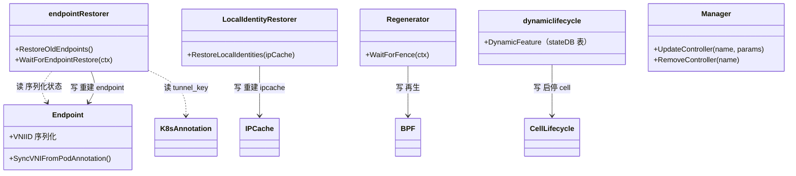
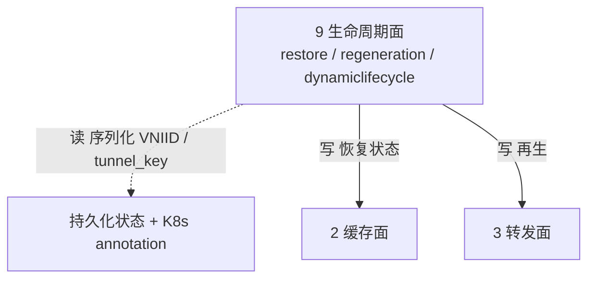

# 第 9 面：生命周期面（升级/重启/修复）

> 一句话职责：**管理其它面的时间维度——升级、重启、修复、模式开关，保证状态迁移收敛而不塌缩。**
> 轴定位：轴3=生命周期（横切），贯穿所有阶段/特性域。
> 承上启下：承上**读**控制面的期望状态与持久化状态；启下**写**恢复后的状态到缓存面/转发面。

## 1. 定位（文件）

| 范围 | 目录/文件 | 说明 |
| --- | --- | --- |
| 启动恢复 | `daemon/cmd/endpoint_restore.go` | 重启恢复 endpoint |
| endpoint 恢复 | `pkg/endpoint/restore.go` | VNIID 序列化 + 重读 annotation |
| ipcache 恢复 | `pkg/ipcache/restore/` | 重建 ipcache |
| 再生生命周期 | `pkg/endpoint/regeneration/` | BPF 再生 |
| 动态启停 | `pkg/dynamiclifecycle/`、`pkg/dynamicconfig/`、`pkg/driftchecker/` | 动态 feature 开关 |
| operator 生命周期 | `operator/cmd/lifecycle.go` | 领导者选举 + 启动序 |
| 生命周期原语 | `pkg/hive/`（health/ondemand/fence） | hive 生命周期 |
| 控制循环 | `pkg/controller/` | GC/重试 |

## 2. 对象模型

> 图例：实线=写；虚线=读。**打磨修正**：`EndpointRestore`→`endpointRestorer`（`daemon/cmd/endpoint_restore.go`）；
> `IPCacheRestore`→`LocalIdentityRestorer`（`pkg/ipcache/restore`）；`DynamicLifecycle` 实际是 `dynamiclifecycle` cell + `DynamicFeature` stateDB 表；
> `ControllerManager`→`Manager`（`pkg/controller/manager.go`）。生命周期面是「流程性」面，关注状态迁移矩阵而非稳态数据键。

## 3. 状态所有权

生命周期面不长期拥有业务状态，它**迁移**状态：

| 迁移 | 写入者 | 去向 |
| --- | --- | --- |
| endpoint 恢复（含 VNIID） | `endpointRestorer` | 缓存面 endpoint 索引 |
| ipcache 重建（VNI-scoped map） | `LocalIdentityRestorer` | 缓存面 ipcache |
| BPF 再生 | `Regenerator` | 转发面 |
| cell 启停 | `dynamiclifecycle` | 装配面 |

## 4. 读者/写者矩阵（承上启下）

| 方向 | 读/写 | 对象 | 状态 | 用途 |
| --- | --- | --- | --- | --- |
| 承上（读） | 读 | 持久化状态 | 序列化 endpoint（VNIID） | 重启恢复 |
| 承上（读） | 读 | K8s annotation | `tunnel_key` | VNI 重读 |
| 启下（写） | 写 | 缓存面 | endpoint/ipcache 恢复状态 | 重建共享真相 |
| 启下（写） | 写 | 转发面 | BPF 再生 | 状态落地 |

## 5. 层间概览（聚焦生命周期面）

## 6. (VNI, IP) 完备性判定：流程性，已文档化

结论：生命周期面本身不产生 `(VNI, IP)` 数据键，但它是**每个 VNI 决策在时间轴上的正确性保证**。

| 场景 | 证据 | 收敛规则 |
| --- | --- | --- |
| agent 重启（模式不变） | `Documentation/network/native-vpc.rst` | VNIID 序列化保留；annotation 可用时重读；VNI ipcache map 重建 |
| 开启/关闭模式 | 同上 | fragment key 与 VNI ipcache 布局随模式重建；关闭时清扫 stale pin；VNIID 不跨模式恢复 |
| 升级/降级 | 同上 | 升级须全量先行；降级安全（未知 annotation/JSON 字段被忽略，map 重建） |
| 修复 | 同上 | annotation 缺失 → 重启 kube-ovn-controller 回填 → 重启 Cilium 重读；运行中 VNI 变更不热应用 |
| VNI 变更/消失 | `pkg/endpoint/restore.go` | 运行中 endpoint 不因 annotation 消失而降级为 plain 方案 |

## 7. 边界与风险

- **边界**：生命周期面不拥有稳态数据键，VNI 正确性依赖「序列化 VNIID + annotation 单一事实源」两条腿。
- **风险 1**：VNIID 若在模式关闭时被恢复，会出现「半配置」endpoint（有 VNI 标识/key，却无 VNI map 可写），
  对端会把它解析成 world——文档化规则是「关闭模式不恢复 VNIID」。
- **风险 2**：混合版本升级期间，老 agent 不懂 `IPIdentityPair.Vni` 会拒绝 scoped key，故升级必须全量先行。
- **风险 3**：VNI 变更不热应用是**故意**的收敛策略，运维必须按「重启 kube-ovn-controller → 重启 Cilium」流程走。

## 8. 承上启下一句话

> 生命周期面**读**持久化的 VNIID 与 annotation 事实源，**写**恢复/再生状态，
> 用「序列化 + 重读 + 不跨模式恢复 + 全量升级」保证 VNI 状态在时间轴上收敛。

## 9. 互链：对象模型 ↔ 层间概览 ↔ 路

- 本层对象模型见 §2，层间概览见 §5；层边界与顶层 API 见 [00-overview.md](00-overview.md)。
- 经过本层的路：[endpoint-restore](../road/endpoint-restore.md)。
- 完备性账本见 [completeness.md](completeness.md)，待完善点见 [todo.md](todo.md)。

## 10. review 结论（完备性 / 正确性 / 兼容性）

- **完备性** ✅：对象 `endpointRestorer/LocalIdentityRestorer/Regenerator/dynamiclifecycle/Manager` 读者/写者已入账，无孤儿。
- **正确性** ✅：VNIID 随序列化 endpoint 存活；`SyncVNIFromPodAnnotation` 用统一决策表 `nativevpc.VNIFromPod` 重读；`LocalIdentityRestorer.RestoreLocalIdentities` 重建 VNI-scoped ipcache；关闭模式不恢复 VNIID（避免半配置）。
- **兼容性** ✅：升级全量先行（老 agent 拒绝 `IPIdentityPair.Vni`）；降级安全（未知 annotation/JSON 字段忽略）；修复走「重启 kube-ovn-controller → 重启 Cilium」重读。
- **风险**：运行中 VNI 变更不热应用（故意），运维须按文档流程走，否则 VNI 状态与 annotation 不一致。
