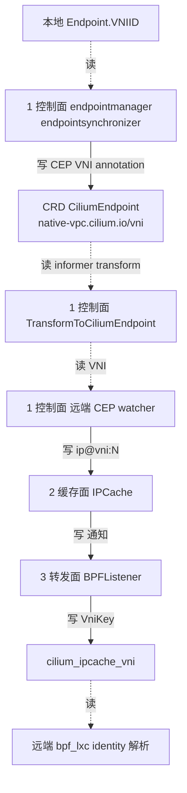

# 路：CEP → 全节点 VNI 传播（跨节点 identity 解析）

> 起点：本地 endpoint 的 VNI（`Endpoint.VNIID`）。
> 终点：其它节点 remote endpoint 的 `IPCache` 里 `ip@vni:N` 条目 → 转发面按 `(VNI, IP)` 解析 identity。
> 定位：VNI 路的**横向分支**——VNI 不只在本节点生效，还要经 CEP/kvstore 传到所有节点。

## 1. 完整路线

## 2. 逐层对象与文件（地图坐标）

| 层 | 对象 | 动作 | 文件 |
| --- | --- | --- | --- |
| 1 控制面 | `endpointsynchronizer` | 把 `Endpoint.VNIID` 写成 CEP annotation（create + RFC6901 转义 backfill） | `pkg/endpointmanager/endpointsynchronizer.go` |
| 1 控制面 | `TransformToCiliumEndpoint` | CEP informer 只保留 VNI annotation，其余丢弃 | `pkg/k8s/factory_functions.go` |
| 1 控制面 | `ciliumEndpointVNI` | 远端 watcher 从 CEP annotation 提取 VNI | `pkg/k8s/watchers/cilium_endpoint.go` |
| 2 缓存面 | `IPCache` | 写 `KeyWithVNI(ip, vni)` → `ip@vni:N` | `pkg/ipcache/ipcache.go` |
| 2 缓存面 | `IPIdentitySynchronizer` | kvstore 模式：`IPIdentityPair.Vni` + scoped key | `pkg/ipcache/kvstore.go` |
| 3 转发面 | `BPFListener` | `Vni≠0` 分发到 `cilium_ipcache_vni`（`VniKey`），非 L3 路由 | `pkg/datapath/ipcache/listener.go` |

## 3. 两条传播通道

| 通道 | 携带 VNI 的载体 | 文件 |
| --- | --- | --- |
| CRD（默认） | CEP annotation `native-vpc.cilium.io/vni` | `pkg/annotation/k8s.go` |
| kvstore（CRD-only 关闭时） | `IPIdentityPair.Vni` + `ip@vni:N` key | `pkg/ipcache/kvstore.go` |

## 4. 三个 fail-closed 点（本路的正确性红线）

| 场景 | 对象 | 行为 |
| --- | --- | --- |
| CEP transform 丢 annotation | `TransformToCiliumEndpoint` | 只保留 VNI annotation（其余全丢），否则远端 endpoint 无 VNI → 不可解析 |
| CEP backfill patch 失败 | `endpointsynchronizer` | VNI annotation key 含 `/`，必须 RFC6901 转义，否则整个 patch（含 status）失败 |
| CES 开启 | 启动门禁 | CES 的 `CoreCiliumEndpoint` 无 object metadata，无法携带 VNI，启动即拒绝 |

## 5. 基线 vs 增量

- **基线**：CEP 只传 IP/identity，远端 watcher 写裸 IP 到 ipcache。
- **VNI 增量**：CEP 多一个 VNI annotation；远端 watcher 用 `KeyWithVNI(ip, vni)` 写 scoped key；
  数据面多一张 `cilium_ipcache_vni`。三个 fail-closed 点都是在「VNI 可能丢」的地方补的守卫。

## 6. 地图坐标小结

这条路是 `vni-ip-to-identity` 的**镜像**：本节点是「读 annotation → 写本地 ipcache」，这条路是「写 annotation → 远端读 annotation → 写远端 ipcache」。两条路合起来，`(VNI, IP)` 才在整个集群闭合。
