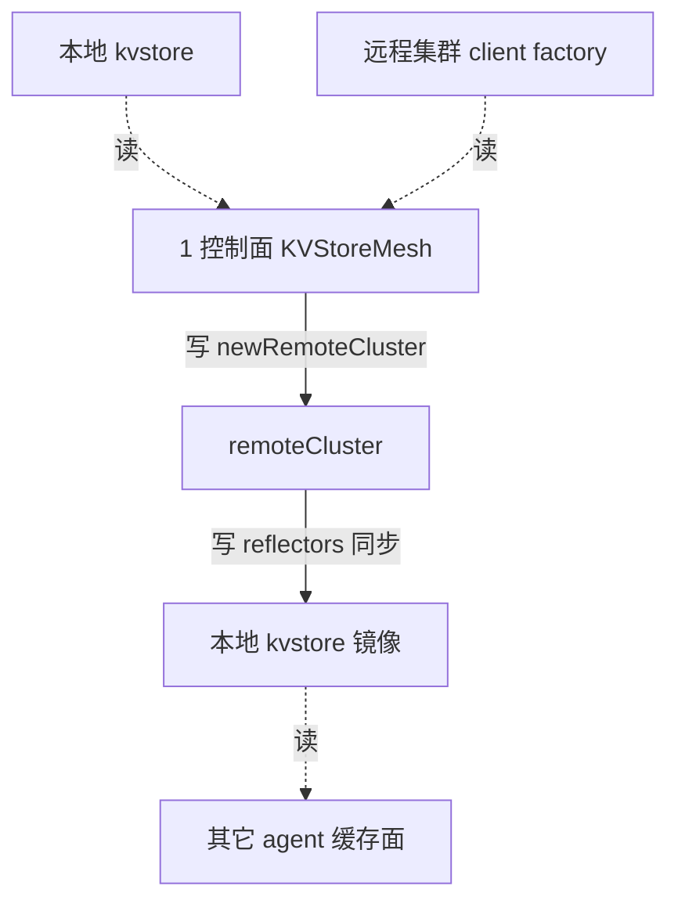

# 路：KVStoreMesh 跨集群同步（clustermesh-apiserver）

> 起点：本地集群 kvstore（identities/ipcache/service）+ 远程集群 client。
> 终点：各远程集群的 kvstore 状态在本集群可读（多集群 identity/服务同步）。
> 定位：clustermesh-apiserver 组件的首条路，补齐「路×组件」矩阵里该组件零覆盖的缺口。

## 1. 完整路线

## 2. 逐层对象与文件（地图坐标）

| 层 | 对象 | 动作 | 文件 |
| --- | --- | --- | --- |
| 1 控制面 | `KVStoreMesh` | 创建远程集群 + reflector 同步 | `pkg/clustermesh/kvstoremesh/kvstoremesh.go` |
| 1 控制面 | `remoteCluster` | 远程集群资源/状态同步 | `pkg/clustermesh/kvstoremesh/remote_cluster.go` |
| 1 控制面 | `clustersHandler` | kvstoremesh API | `pkg/clustermesh/kvstoremesh/api.go` |
| 10 装配 | `kvstoremesh.Cell` | hive 装配 | `pkg/clustermesh/kvstoremesh/cell.go` |

## 3. VNI 视角：集群级键，与 VPC 无关

- 同步的键是 identity / ipcache（含 `ip@vni:N`）/ service，都是**集群级键**。
- VNI 是「同一集群内不同 VPC」的作用域，与 ClusterMesh 的「跨集群」作用域正交——VPC ≠ ClusterMesh。
- 因此这条路对 VNI 是**透明透传**，不改变 `(VNI, IP)` 语义，也不需要在 KVStoreMesh 里加 VNI 字段。

## 4. 基线 vs 增量

- **基线**：KVStoreMesh 同步 identities/ipcache/service。
- **native-vpc 增量**：无（ipcache 里的 `ip@vni:N` 与 `IPIdentityPair.Vni` 随现有键透传）。

## 5. 地图坐标小结

这条路的结论是「**无需改动**」——多集群同步与 VPC 作用域是两层正交的命名空间。这也印证了地图的价值：有些路走一遍只是为了确认「这里不用动」。
