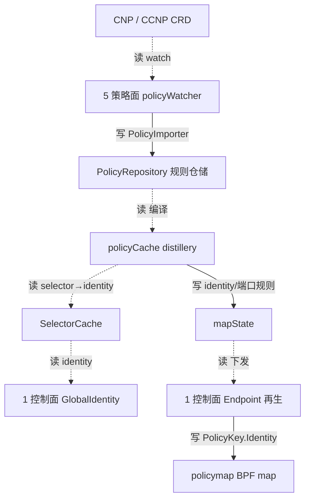

# 路：CNP → policy map（策略编译下发）

> 起点：CRD `CiliumNetworkPolicy`(CNP) / `CiliumClusterwideNetworkPolicy`(CCNP)。
> 终点：转发面 `policymap`（`PolicyKey.Identity` 键）。
> 定位：identity 链的**终点执行路**——策略语义经 identity 编译成 mapState，再下发到 BPF policy map。

## 1. 完整路线

## 2. 逐层对象与文件（地图坐标）

| 层 | 对象 | 动作 | 文件 |
| --- | --- | --- | --- |
| 5 策略面 | `policyWatcher` | watch CNP/CCNP，转成 `SlimCNP`，交给 `PolicyImporter` | `pkg/policy/k8s/watcher.go`、`cilium_network_policy.go` |
| 5 策略面 | `PolicyRepository` | 持有 `rules`/`revision`/`selectorCache`/`policyCache`；`MustAddList` 入库 | `pkg/policy/repository.go` |
| 5 策略面 | `policyCache` | 按 endpoint identity 蒸馏出 `selectorPolicy` | `pkg/policy/distillery.go` |
| 5 策略面 | `SelectorCache` | selector → identity 集合 | `pkg/policy/selectorcache.go` |
| 1 控制面 | `GlobalIdentity` | identity key（labels 派生） | `pkg/identity/key/global_identity.go` |
| 5 策略面 | `mapState` | identity/端口规则（`Key{Identity,TrafficDirection,Protocol,Port}`） | `pkg/policy/mapstate.go` |
| 1 控制面 | `Endpoint` | 再生时 `syncPolicyMapWith` 下发 mapState | `pkg/endpoint/policy.go` |
| 3 转发面 | `policymap` | `PolicyKey{Identity,TrafficDirection,Nexthdr,DestPort}` | `pkg/maps/policymap/policymap.go` |

## 3. VNI 视角：为什么这条路「经 identity 天然 VNI 化」

`policymap` 的 key 是 **identity（`sec_label`）**，不是 IP。所以：

1. 控制面把 VNI 注入 identity label（`vni:io-cilium-native-vpc-vni=<vni>`）→ 不同 VNI 得不同 identity（第 1 面保证）。
2. 策略面 `SelectorCache` 读 identity，`fromEndpoints/toEndpoints` 天然按 VNI 区分。
3. `mapState`/`policymap` 全程只碰 identity，**VNI 从不直接出现在策略 key 里**——VNI-scoped ipcache 在更早一步选对了 identity。

> 结论：这条路不需要任何 VNI 字段，因为 VNI 在 identity 层就已被编码。

## 4. 三处边界（这条路走不到的地方）

| 边界 | 为什么走不到 | 证据 |
| --- | --- | --- |
| CIDR 规则 | `toCIDR/fromCIDR` 按裸 prefix 选择，不经过 identity | `pkg/policy/cidr.go`（无 VNI） |
| FQDN 规则 | FQDN→IP 带 VNI，但连接级 VNI 未知时 fail-closed | `pkg/fqdn/service/service.go`、`dnsproxy/proxy.go` |
| L7 代理 | Envoy/DNS 需透传 VNIID 到 accesslog，否则 L7 flow 退化为裸 IP | `pkg/proxy/accesslog/record.go` |

## 5. 基线 vs 增量

- **基线**：CNP → Repository → policyCache → SelectorCache → mapState → policymap（本条路，无 VNI）。
- **VNI 增量**：不在这条路的任何节点加 VNI；VNI 在**上游 identity 分配**（`GlobalIdentity` 的 VNI label）完成，
  这条路的 identity 键自动继承 VNI 区分。这就是「策略面经 identity 天然 VNI 化」的完整解释。
