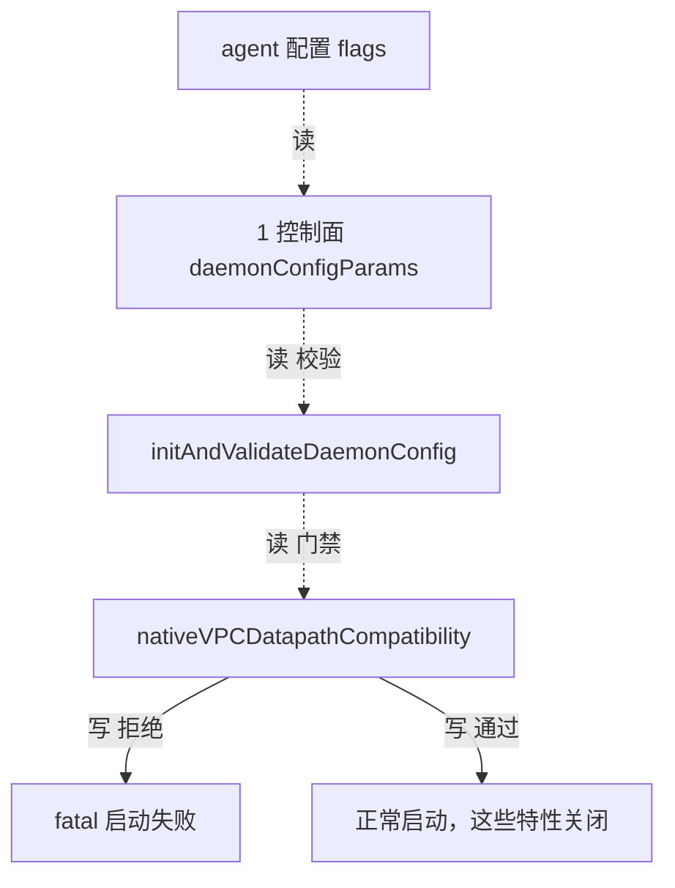

# 路：加密 / egress / masquerade 拒绝（面 8 补缺）

> 起点：agent 配置（`--enable-native-vpc` + `--enable-egress-gateway` / `--enable-bpf-masquerade` / IPsec / WireGuard / SRv6 / VTEP）。
> 终点：启动失败（fatal）或正常启动（未开这些特性）。
> 定位：面 8 的 ❌ 路。这族特性全部**按裸 IP 选流量或选对端**，native-vpc 下无法表达 `(VNI, IP)`，于是走「拒绝」而不是「错误转发」。

## 1. 完整路线

## 2. 逐层对象与文件（地图坐标）

| 层 | 对象 | 动作 | 文件 |
| --- | --- | --- | --- |
| 1 控制面 | `daemonConfigParams` | 聚合 `DaemonConfig`/`KPRConfig`/`IPSecConfig`/`WireguardConfig` | `daemon/cmd/daemon_main.go` |
| 1 控制面 | `initAndValidateDaemonConfig` | 先跑 native-vpc 兼容门禁 | `daemon/cmd/daemon.go` |
| 1 控制面 | `nativeVPCDatapathCompatibility` | 逐条拒绝裸 IP 键特性 | `daemon/cmd/daemon.go` |
| 8 加密面 | `EgressManager` / `IPMasqAgent` / `wireguard.Agent` / `ipsec.Agent` | 各自按裸 IP/裸 CIDR 键（被门禁拦住） | `pkg/egressgateway`、`pkg/ipmasq`、`pkg/wireguard`、`pkg/datapath/linux/ipsec` |
| 10 装配 | `TestNativeVPCRejectsBareIPKeyedFeatures` | 门禁的回归测试 | `daemon/cmd/native_vpc_validation_test.go` |

## 3. 门禁清单（每一条 = 一个裸 IP 键）

| 特性 | 裸 IP 键 | 拒绝消息（`daemon.go`） |
| --- | --- | --- |
| egress gateway | pod 源 IP | `...egress gateway: its policies select traffic by the bare source IP` |
| SRv6 | 源 IP → VRF | `...SRv6: the VRF mapping selects traffic by the bare source IP` |
| VTEP | 裸 CIDR → tunnel endpoint | `...VTEP integration: its mappings are keyed by bare CIDRs` |
| BPF masquerade | 裸五元组 | `...BPF masquerade: ...NAT maps are keyed by the bare tuple` |
| IPsec / WireGuard | node/endpoint IP 选 peer | `...Cilium encryption (IPsec/WireGuard): peer selection is keyed by the bare IP` |

## 4. 基线 vs 增量

- **基线**：这些特性在非 native-vpc 下各自正常走（egress map / ipmasq map / xfrm / WG peer）。
- **native-vpc 增量**：不改变它们内部，只在**最前面**加一道门禁；开 native-vpc 又开任一裸 IP 键特性 → fatal。

> 这条路的哲学与 `service-clusterip-to-backend` 一致：**能 VNI 化的就 VNI 化（如分片），不能的就启动拒绝**。

## 5. 地图坐标小结

面 8 零覆盖的补缺路。它证明 ❌ 面的「路」就是**门禁本身**——从配置 → 校验 → 拒绝，一行业务数据都不经手，但保证运行时绝不混流。
