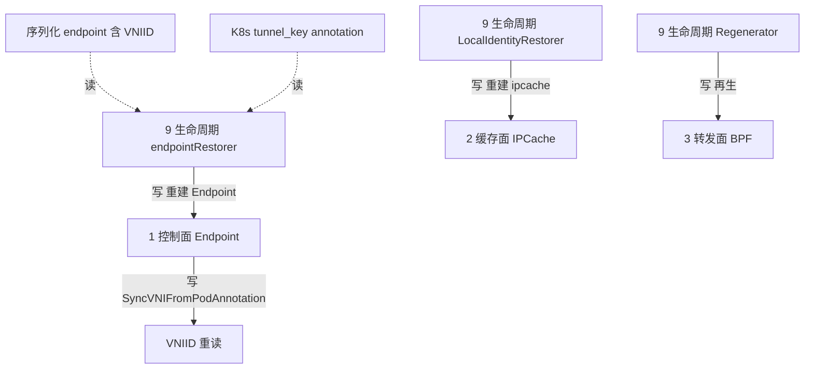

# 路：endpoint 恢复（VNI 序列化 + 重读，面 9 补缺）

> 起点：agent 重启（磁盘上的序列化 endpoint + K8s pod annotation）。
> 终点：endpoint 恢复 + VNI-scoped ipcache 重建 + BPF 再生。
> 定位：面 9（生命周期）的补缺路。VNI 在时间轴上的正确性，靠「序列化 VNIID + 重读 tunnel_key」两条腿。

## 1. 完整路线

## 2. 逐层对象与文件（地图坐标）

| 层 | 对象 | 动作 | 文件 |
| --- | --- | --- | --- |
| 9 生命周期 | `endpointRestorer` | `RestoreOldEndpoints`：读磁盘、校验、重建 | `daemon/cmd/endpoint_restore.go` |
| 1 控制面 | `Endpoint` | `VNIID` 序列化保留；`SyncVNIFromPodAnnotation` 重读 annotation | `pkg/endpoint/endpoint.go` |
| 9 生命周期 | `LocalIdentityRestorer` | `RestoreLocalIdentities` 重建 ipcache | `pkg/ipcache/restore/restore.go` |
| 9 生命周期 | `Regenerator` | `WaitForFence` + 再生 | `pkg/endpoint/regenerator.go` |
| 2 缓存面 | `IPCache` | 重建 VNI-scoped 条目 | `pkg/ipcache/ipcache.go` |

## 3. 收敛规则（VNI 在时间轴上的保证）

| 场景 | 规则 | 证据 |
| --- | --- | --- |
| agent 重启（模式不变） | `VNIID` 随序列化 endpoint 存活；pod 可用时重读 annotation；VNI ipcache map 重建 | `Documentation/network/native-vpc.rst` |
| 开启/关闭模式 | fragment key 与 VNI ipcache 布局随模式重建；关闭时清扫 stale pin；**VNIID 不跨模式恢复** | 同上 |
| VNI 变更/消失 | 运行中 endpoint 不因 annotation 消失而降级为 plain 方案 | `pkg/endpoint/restore.go` |

## 4. 两个关键 fail-closed 点

| 点 | 行为 | 为什么 |
| --- | --- | --- |
| 模式关闭时不恢复 VNIID | 丢弃序列化 VNIID | 否则出现「半配置」endpoint（有 VNI 标识/key，却无 VNI map 可写），对端解析为 world |
| annotation 消失不降级 | 运行中 endpoint 保持 VPC 方案 | 避免瞬时 annotation 缺失把 VPC endpoint 错误降级为 plain |

## 5. 基线 vs 增量

- **基线**：endpoint 恢复只序列化 IP/identity，重启后重读即可。
- **native-vpc 增量**：序列化多一个 `VNIID`；恢复时重读 `tunnel_key` annotation；
  关闭模式时不恢复 VNIID；VNI ipcache map 单独重建。

## 6. 地图坐标小结

面 9 零覆盖的补缺路。它证明生命周期面的「路」是**状态迁移矩阵**——每一步迁移都回答：VNIID 从哪来、要不要保留、什么时候丢弃。
