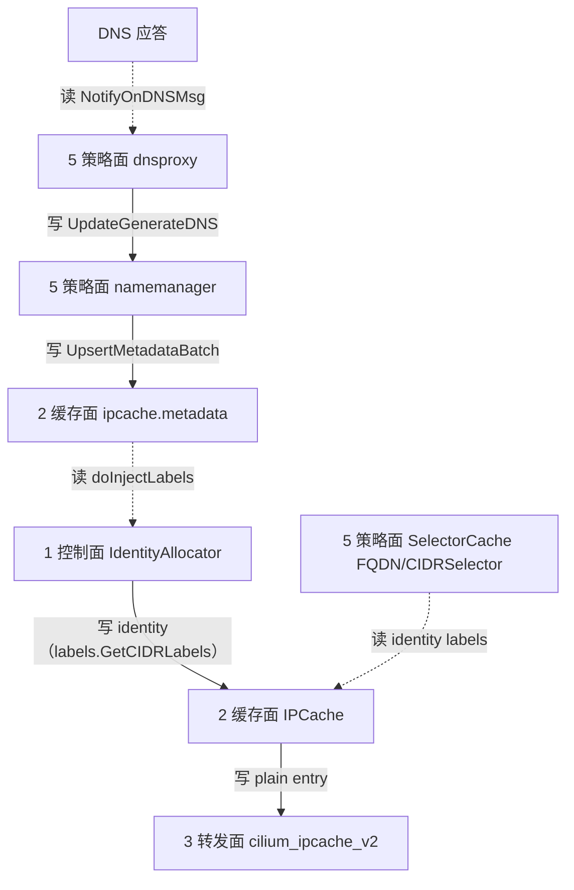

# 路：FQDN / CIDR 身份（裸前缀基线 + VNI 缺口）

> 起点：DNS 应答 / `toCIDR` 规则里的前缀。
> 终点：本地 scope identity + `cilium_ipcache_v2` 条目；策略侧 `SelectorCache` 按 identity 匹配。
> 定位：策略面的**边界路**。当前整条链是**裸前缀**（`PrefixCluster{prefix, clusterID}`），无 VNI 维度；本路记录基线 + VNI 缺口 + 增量评估。

## 1. 完整路线（当前基线）

## 2. 逐层对象与文件（地图坐标）

| 层 | 对象 | 动作 | 文件 |
| --- | --- | --- | --- |
| 5 策略面 | `dnsproxy` | `NotifyOnDNSMsg` 把 DNS 应答交给上层 | `pkg/fqdn/dnsproxy/proxy.go` |
| 5 策略面 | `namemanager.manager` | `UpdateGenerateDNS` 更新 name→IP 缓存 | `pkg/fqdn/namemanager/manager.go` |
| 2 缓存面 | `ipcache.metadata` | `UpsertMetadataBatch` 写 IDMD map（key=`PrefixCluster{prefix,clusterID}`） | `pkg/ipcache/metadata.go` |
| 2 缓存面 | `IPCache.doInjectLabels` | 从 IDMD 读 labels → 分配 identity → 写 ipcache entry | `pkg/ipcache/metadata.go` |
| 1 控制面 | `IdentityAllocator` | 按 labels 分配本地 scope identity | `pkg/ipcache`（`Configuration.IdentityAllocator`） |
| 5 策略面 | `SelectorCache` | `RegisterFQDNSelector`/FQDNSelector/CIDRSelector 全局共享，按 identity labels 匹配 | `pkg/policy/selectorcache.go` |
| 1 控制面 | `labels.GetCIDRLabels` | prefix → CIDR 标签（**无 VNI**） | `pkg/labels/cidr.go` |

## 3. VNI 缺口：为什么现在是裸前缀

关键点：整条链的 key 是 `PrefixCluster{prefix, clusterID}`，**没有 VNI 维度**；identity 由 `labels.GetCIDRLabels()` 派生，**没有 VNI 标签**。
所以两个 VPC 里同一个 `10.16.32.10` 走 FQDN/CIDR 路径时，是**同一个身份**。

## 4. 场景矩阵（要不要扩展）

| 场景 | 受影响？ | 说明 |
| --- | --- | --- |
| toFQDN 指公网域名 | 否 | 公网 IP 全局唯一，(VNI,IP) 退化为 IP |
| toCIDR 指集群外网段 | 否（前提不重叠） | 同上 |
| toFQDN/toCIDR 指 VPC 内部重叠地址 | **是** | 两 VPC 同 IP 共用一个 CIDR/FQDN 身份，策略无法区分 |
| 用 endpoint selector 表达东西向 | 否 | endpoint identity 已带 `vni:io-cilium-native-vpc-vni=N` |

> 隐性保护：`bpf_lxc` VNI map 优先、plain map 兜底，同 VPC 的 peer 一定按 pod identity 判定，
> `toCIDR 10.16.32.10/32` 不会命中同 VPC 的 pod。风险集中在「跨 VPC 的同 IP 目标被同一条 FQDN/CIDR 规则覆盖」。

## 5. 增量评估（真要 VNI 化，按子系统清点）

| 子系统 | 要改什么 | 难度 |
| --- | --- | --- |
| `cmtypes.PrefixCluster` | 加 VNI 维度（结构体/构造/解析/String） | 机械但面广（133 处引用/18 非测试文件） |
| `pkg/labels/cidr.go GetCIDRLabels` | 注入 `vni:` 标签 → identity 自然按 VNI 分裂 | 低（最优雅） |
| `pkg/ipcache/metadata.go` | metadata key、InjectLabels、identity 分配/释放、restore 全按 (VNI,prefix) | 中高 |
| `pkg/policy/selectorcache*.go` | selector 全局共享 → 按 (selector,VNI) 实例化 或 CNP 显式写 VNI 标签 | 高（策略正确性关键路径） |
| `pkg/fqdn/namemanager` | name→IP 变 name→(VNI,IP) | 中 |
| DNS 持久化 / SDP | `restore.RuleIPOrCIDR` + `standalone-dns-proxy` proto 加 VNI | 中（跨版本兼容） |
| datapath | CIDR/FQDN 条目按 VNI 复制进 `cilium_ipcache_vni` | 中（map size 重估） |

**综合**：跨 6~7 子系统、1500+ LOC、踩在 SelectorCache 上游最活跃路径上，回归/rebase 成本高。

## 6. 建议（低成本动作）

1. **规范化替代**：策略翻译器对「VPC 内部目标」一律生成 endpoint selector（可显式带 `io-cilium-native-vpc-vni`），只对「集群外目标」用 toCIDR/toFQDN。
2. **护栏（~50 行）**：策略导入时若 toCIDR/toFQDN 前缀落在已知 VPC 子网内，打 warning + metric。
3. **完整版拆独立 PR 序列**：labels 带 VNI → PrefixCluster 带 VNI → metadata/ipcache → selectorcache → DNS/SDP 协议，每步单独可回滚。

## 7. 地图坐标小结

这条路把「FQDN/CIDR 策略」从 DNS 应答一路追到 identity 分配与 BPF 下发，暴露了策略面最大的 VNI 边界：
**identity 路径天然 VNI 化，CIDR/FQDN 路径裸前缀**。当前结论：有条件需要、优先级低，先规范化替代 + 护栏，完整版拆 PR。
