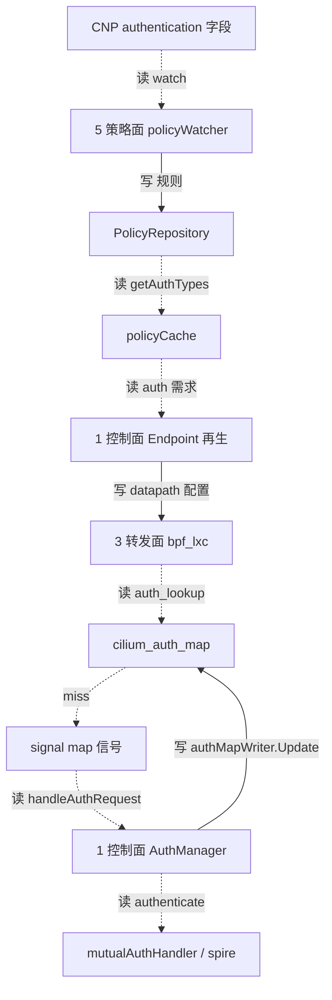

# 路：Mutual Auth（CNP auth 规则 → cilium_auth_map）

> 起点：CRD `CiliumNetworkPolicy` 里的 `authentication` 字段（auth type，如 `spire`/`always-fail`）。
> 终点：转发面 `cilium_auth_map`（键 = `{local_id, remote_id, remote_node_id, auth_type}`）。
> 定位：**非 VNI 特性的找路验证**——证明 `map/` 不只为 VNI 服务，任何特性都能从地图找出一条路。

## 1. 完整路线

## 2. 逐层对象与文件（地图坐标）

| 层 | 对象 | 动作 | 文件 |
| --- | --- | --- | --- |
| 5 策略面 | `policyWatcher` | watch CNP（含 auth 字段） | `pkg/policy/k8s/watcher.go` |
| 5 策略面 | `PolicyRepository` | 存规则 | `pkg/policy/repository.go` |
| 5 策略面 | `policyCache` | `getAuthTypes(localID, remoteID)` | `pkg/policy/distillery.go` |
| 1 控制面 | `Endpoint` | 再生时下发 auth 需求到 datapath | `pkg/endpoint/policy.go` |
| 3 转发面 | `bpf_lxc` | `auth_lookup(ctx, local_id, remote_id, remote_node_ip, auth_type)` | `bpf/lib/auth.h` |
| 3 转发面 | `cilium_auth_map` | `{LocalIdentity, RemoteIdentity, RemoteNodeID, AuthType}` → `auth_info` | `bpf/lib/auth.h`、`pkg/maps/authmap/auth_map.go` |
| 1 控制面 | `AuthManager` | `handleAuthRequest` 收 signal → 跑 auth handler → 写 auth map | `pkg/auth/manager.go` |
| 1 控制面 | `mutualAuthHandler` | 用 Spire/certs 做 mTLS 认证 | `pkg/auth/mutual_authhandler.go`、`pkg/auth/spire` |
| 1 控制面 | `authMapWriter` | `Update/Delete` auth map | `pkg/auth/authmap_writer.go` |
| 1 控制面 | `authMapGarbageCollector` | 删掉不再被策略要求的 auth entry | `pkg/auth/authmap_gc.go` |
| 10 装配 | `auth.Cell` | 装配 manager/handler/map | `pkg/auth/cell.go` |

## 3. VNI 视角：identity 键，天然安全

`cilium_auth_map` 的键是 **identity**（`local_sec_label` / `remote_sec_label`），不是 IP：

- 与 policymap 同理，VNI 已在 identity 层编码，auth map 无需任何 VNI 字段。
- `auth_lookup` 里的 `remote_node_ip` 只用于解析 `remote_node_id`（节点 id），不参与 key；节点 IP 是集群唯一（非 VPC 作用域）。

> 结论：这是「经 identity 天然 VNI 化」的又一实例，策略面之外，auth 面也享受同一机制。

## 4. 这条路的三个门禁（与装配面三失败模式呼应）

| 门禁 | 说明 |
| --- | --- |
| auth.Cell 装配 | `pkg/auth/cell.go` 提供 manager/handler，缺失类型会让 agent 启动失败（`TestAgentCell` 兜底） |
| auth handler 类型唯一 | `newAuthManager` 拒绝同一 auth type 多个 handler |
| auth map GC | `authMapGarbageCollector` 读 policyRepository，删除不再被策略要求的 entry |

## 5. 验证结论：地图可复用

这条路从「CNP auth 字段」出发，经 5 策略面 → 1 控制面 → 3 转发面 → 10 装配，逐层对象都在 `map/completeness.md` 账本里能找到归属，无一处需要为 auth 另建层。

> 这验证了 `cilium 图路` 的顶层意图：**地图是完整的分层架构，任何特性只是地图上的一条路。**
