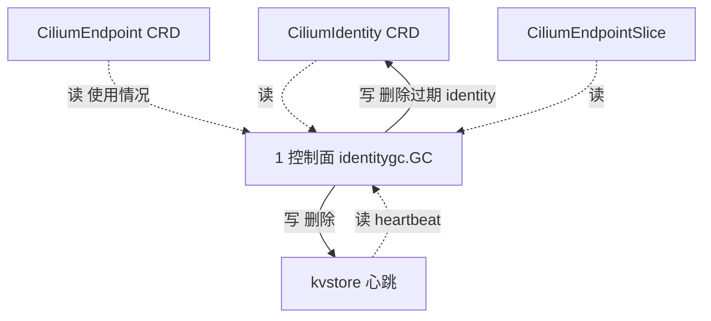

# 路：operator identity GC（identity 键的集群级回收）

> 起点：operator 周期定时（`--identity-gc-interval`）+ CiliumIdentity/CiliumEndpoint/CES CRD + kvstore 心跳。
> 终点：删除过期/未使用的 identity（CiliumIdentity CRD / kvstore）。
> 定位：operator 组件的第一条路，补齐「operator 对象已入账但零路覆盖」的缺口。

## 1. 完整路线

## 2. 逐层对象与文件（地图坐标）

| 层 | 对象 | 动作 | 文件 |
| --- | --- | --- | --- |
| 1 控制面 | `identitygc.GC` | 周期扫描 identity 使用情况，删过期项 | `operator/identitygc/gc.go` |
| 1 控制面 | `heartbeatStore` | 记录 identity 心跳 | `operator/identitygc/heartbeat.go` |
| 1 控制面 | `identitygc.Metrics` | GC 指标 | `operator/identitygc/metrics.go` |
| 10 装配 | `identitygc.Cell` | hive 装配（`cell.Invoke(registerGC)`） | `operator/identitygc/cell.go` |

## 3. VNI 视角：identity 键，安全

`identitygc` 只处理 **identity**（CiliumIdentity 的 numeric id + 使用引用 + 心跳），**不重算 labels**，也**不碰裸 IP**：

- native-vpc 的 VNI 已被编码进 identity（`vni:...` label → 不同 numeric identity），GC 删除的只是「没人用」的 identity，不会把不同 VNI 的 identity 混起来。
- 文档明确：operator 的 identity GC 是安全的；**不安全的是 `ciliumidentity` 控制器**（从 pod/ns labels 派生 identity，不知 VNI annotation），所以它在 native-vpc 下启动即拒。

> 结论：同属 operator，`identitygc` ✅ 安全，`ciliumidentity` ❌ 被拒——组件不决定 VNI 安全，**键是什么**才决定。

## 4. 基线 vs 增量

| 节点 | 基线 | native-vpc 增量 |
| --- | --- | --- |
| identitygc | 按 usage + 心跳 GC | 无增量（identity 键，天然安全） |
| ciliumidentity 控制器 | 从 labels 派生 CID | 启动即拒（不知 VNI annotation） |

## 5. 地图坐标小结

这是「组件 ≠ 层」的最好例子：operator 是组件，`identitygc` 和 `ciliumidentity` 都属层 1 控制面，
但一个经 identity 键安全、一个按 labels 派生被拒。**找路时先问「键是什么」，再问「在哪个组件」。**
