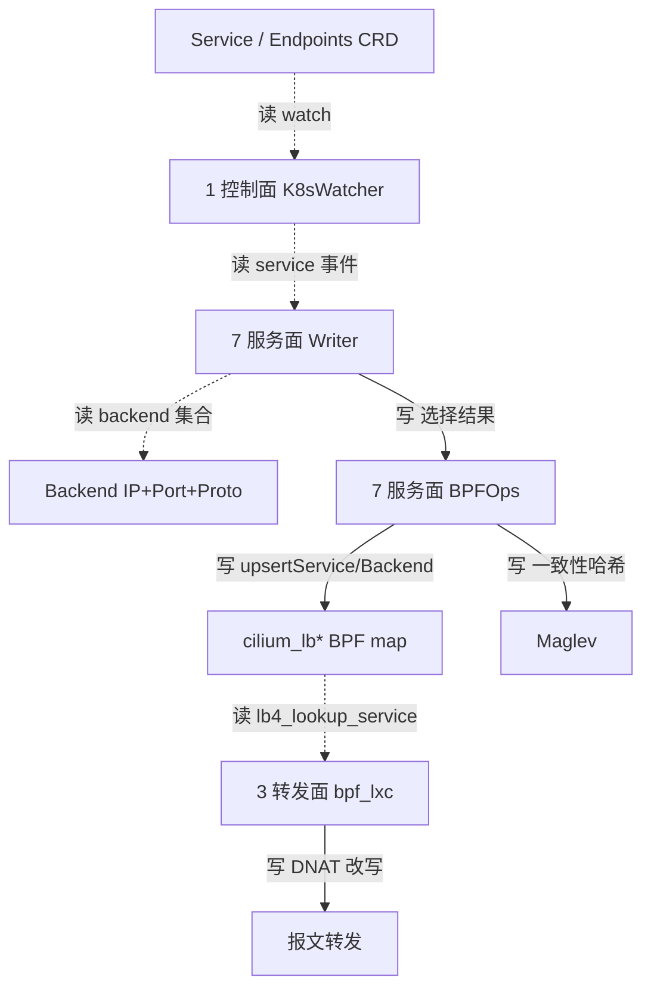

# 路：Service ClusterIP → backend（服务面，❌ 启动即拒绝）

> 起点：CRD `Service`(ClusterIP) + `Endpoints/EndpointSlice`。
> 终点：转发面 `cilium_lb*` backend map → `bpf_lxc` `lb4_lookup_service()`。
> 定位：这是三条 ❌ 路之一。基线里 backend 按裸 `(IP, port, proto)` 键，native-vpc 下会**跨租户重定向**，因此**启动即拒绝 + 数据面绕过**。

## 1. 完整路线（基线，非 native-vpc）



## 2. 逐层对象与文件（地图坐标）

| 层 | 对象 | 动作 | 文件 |
| --- | --- | --- | --- |
| 1 控制面 | `K8sWatcher` | watch Service/Endpoints | `pkg/k8s/watchers/*.go` |
| 7 服务面 | `Writer` | `SelectBackends` / `BackendsForService` | `pkg/loadbalancer/writer/writer.go` |
| 7 服务面 | `Backend` | `{IP, Port, Protocol}`（裸 IP） | `pkg/loadbalancer/backend.go` |
| 7 服务面 | `BPFOps` | `upsertService`/`upsertBackend` 写 LB map | `pkg/loadbalancer/reconciler/bpf_reconciler.go` |
| 7 服务面 | `Maglev` | 一致性哈希 | `pkg/maglev/maglev.go` |
| 3 转发面 | `bpf_lxc` | `lb4_lookup_service()` | `bpf/bpf_lxc.c`、`bpf/lib/lb.h` |

## 3. ❌ VNI 视角：为什么裸 IP backend 会跨租户重定向

backend 地址只是 IP：`(IP, port, proto)`。两个 VPC 的 pod 共享 IP 时：

1. 两条 backend 塌缩成一条（同 key）。
2. 翻译 ClusterIP 时，把 A 租户流量重写成本 VPC 里「恰好也占着这个 IP」的 pod——即**静默重定向到 B 租户**。

## 4. native-vpc 的两层关闭

| 层 | 机制 | 证据 |
| --- | --- | --- |
| 配置层 | KPR / socketLB 启动即拒绝 | `daemon/cmd/daemon.go` `nativeVPCDatapathCompatibility` |
| 数据面 | `CONFIG(native_vpc_vni)>0` 时 `bpf_lxc` 完全跳过 `lb4_lookup_service()` | `Documentation/network/native-vpc.rst` + `bpf/bpf_lxc.c` |

> 为什么 `kubeProxyReplacement:false` 不够：LB 控制面无条件注册、ClusterIP 前端无条件反射、bpf_lxc 在 socketLB 未全开/SCTP 开启时仍编译逐包 LB——所以必须靠数据面规则硬跳过。

## 5. 基线 vs 增量（native-vpc 下这条路的「增量」是「拒绝+绕过」）

| 节点 | 基线 | native-vpc 增量 |
| --- | --- | --- |
| KPR/socketLB | 可用 | 启动即拒绝 |
| LB 控制面 | 无条件注册 | 仍注册，但数据面绕过 |
| bpf_lxc service 查找 | 每包 `lb4_lookup_service()` | `CONFIG(native_vpc_vni)>0` 跳过 |
| service 解析 | Cilium 做 | 让渡给 kube-ovn/kube-proxy（在 VPC 自己的路由域内解析） |

## 6. 验证命令

```shell
cilium-dbg bpf lb list | head          # map 存在且被填充（即使 KPR=false）
cilium-dbg monitor --type trace | grep <clusterIP>  # VPC pod 到 ClusterIP 应原样离开，不被翻译
```
